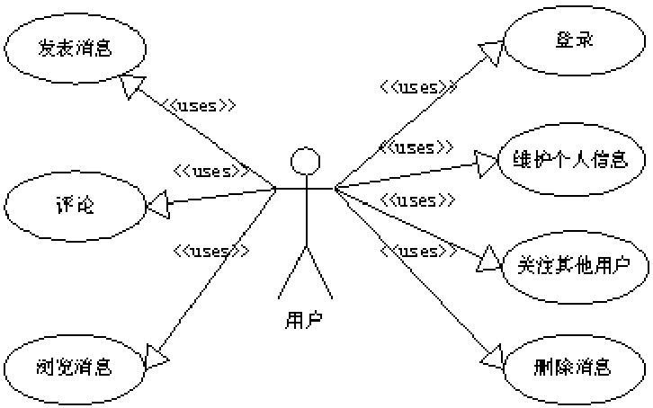
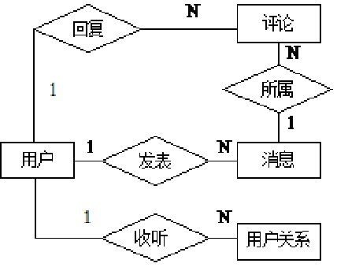

## 需求分析

一个完整的软件系统开发过程分为软件定义阶段、软件开发阶段和软件运行维护阶段。
软件定义阶段主要决定将要开发软件的功能和特性。它又可以细分为问题的定义、可行性研究、需求分析3个阶段。
软件开发阶段又可细分为总体设计、详细设计、程序编制和软件测试4个阶段。
软件运行维护阶段的主要任务是通过各种必要的维护活动使系统持久地满足用户的需求。
我们要开发的是一个简易的微博系统，将重点介绍需求分析和总体设计以及编码实现。

微博是一个基于用户关系的信息分享、传播以及获取平台。它十分简单，也十分便捷，即时通讯功能非常强大，一般发布的消息只是由简单的只言片语组成，对用户的技术要求门槛很低，而且在语言的编排组织上不需要长篇大论，只需要反映自己的心情即可。
在本微博系统中，用户可以发表、转发或评论消息(由于篇幅所限，本系统只支持文本消息)，随时看到被关注者的最新动态，还可以浏览非关注者发表的最新消息。用户之间可以收听或者取消收听。用户对自己发表的消息可以进行删除操作。

系统用例图

## 数据库设计

本系统涉及的数据实体有用户、消息、评论。另外还有一个用户与用户之间的关系。

