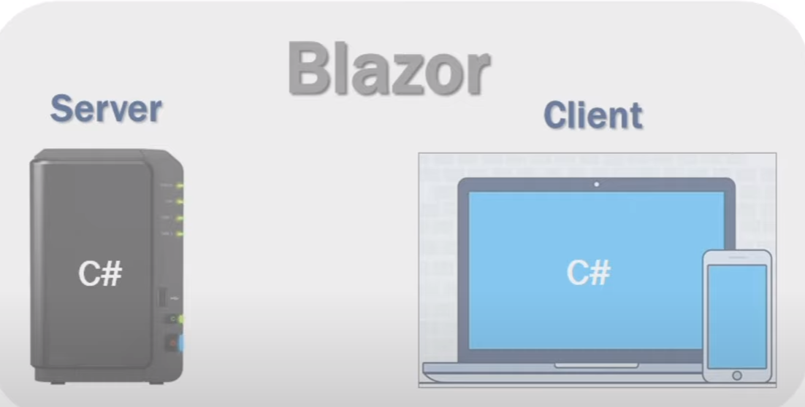
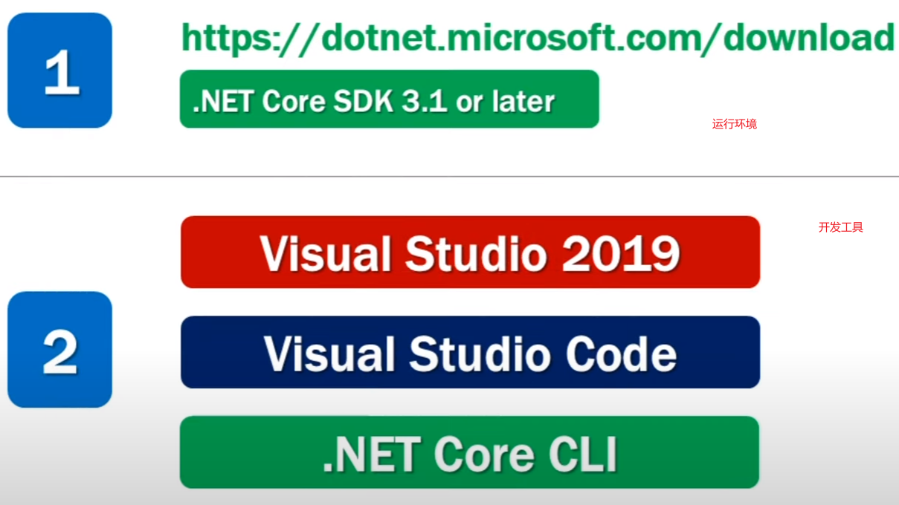
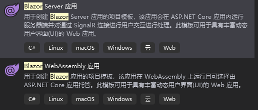
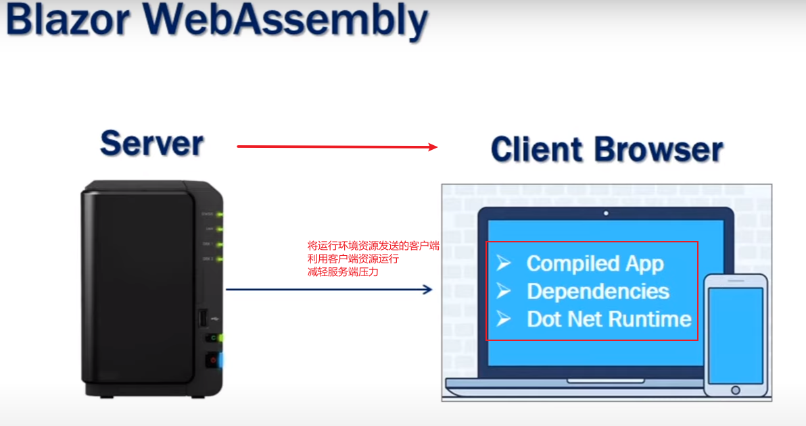
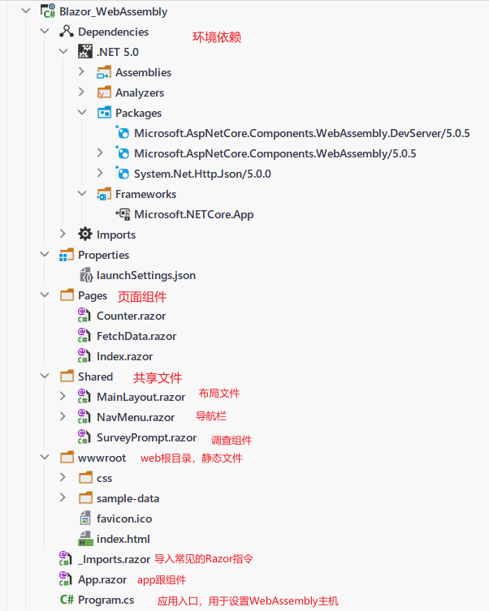
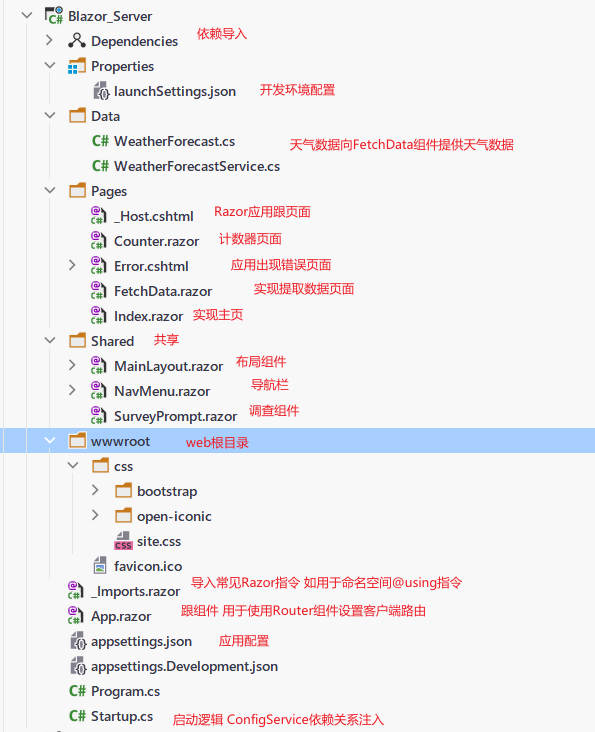

参考地址:https://www.youtube.com/playlist?list=PL6n9fhu94yhVowClAs8-6nYnfsOTma14P

## 1. 什么是Blazor?

Blazor 是一个使用 [.NET](https://docs.microsoft.com/zh-cn/dotnet/standard/tour) 生成交互式客户端 Web UI 的框架：

- 使用 [C#](https://docs.microsoft.com/zh-cn/dotnet/csharp/) 代替 [JavaScript](https://www.javascript.com/) 来创建信息丰富的交互式 UI。
- 共享使用 .NET 编写的服务器端和客户端应用逻辑。
- 将 UI 呈现为 HTML 和 CSS，以支持众多浏览器，其中包括移动浏览器。
- 与新式托管平台（如 [Docker](https://docs.microsoft.com/zh-cn/dotnet/standard/microservices-architecture/container-docker-introduction/index)）集成。



**前提**



## 2. Asp net Core blazor模板






### Blazor Server 和Blazor WebAssembly比较

|                        Blazor Server                         |                      Blazor WebAssembly                      |
| :----------------------------------------------------------: | :----------------------------------------------------------: |
|                  服务器-客户端通过会话连接                   |                  将资源从服务端下载到客户端                  |
|                           **优点**                           |                           **优点**                           |
| 客户端下载资源小，应用加载快；可可充分利用服务器功能；服务器实时调试； |   没有.NET服务器依赖；充分利用客户端资源；减轻服务端压力；   |
|                           **缺点**                           |                           **缺点**                           |
| 延迟高，每次用户交互都需要涉及网络跃点；不支持脱机工作；多用户存在性能问题； | 仅可使用浏览器功能；访问时下载项较大，应用加载时间长；.NET支持不完善 |
|                                                              |                                                              |
|                                                              |                                                              |
|                                                              |                                                              |
|                                                              |                                                              |


## 3. Asp net core 项目创建

### Blazor WebAssembly项目模板



### Blazor Server



## 基础知识

### 路由

路由模板-App.razor

```razor
<Router AppAssembly="@typeof(Program).Assembly">
    <Found Context="routeData">
        <RouteView RouteData="@routeData" DefaultLayout="@typeof(MainLayout)" />
    </Found>
    <NotFound>
        <p>Sorry, there's nothing at this address.</p>
    </NotFound>
</Router>
```

路由参数-`Pages/RouteParameter.razor`:

```razor
@page "/RouteParameter/{text}"

<h1>Blazor is @Text!</h1>

@code {
    [Parameter]
    public string Text { get; set; }
}
```

```razor
@page "/RouteParameter/{text?}"

<h1>Blazor is @Text!</h1>

@code {
    [Parameter]
    public string Text { get; set; }

    protected override void OnInitialized()
    {
        Text = Text ?? "fantastic";
    }
}
```

路由约束

```razor
@page "/user/{Id:int}"

<h1>User Id: @Id</h1>

@code {
    [Parameter]
    public int Id { get; set; }
}
```

| 约束       | 示例              | 匹配项示例                                                   | 固定条件 区域性 匹配 |
| :--------- | :---------------- | :----------------------------------------------------------- | :------------------: |
| `bool`     | `{active:bool}`   | `true`, `FALSE`                                              |          否          |
| `datetime` | `{dob:datetime}`  | `2016-12-31`, `2016-12-31 7:32pm`                            |          是          |
| `decimal`  | `{price:decimal}` | `49.99`, `-1,000.01`                                         |          是          |
| `double`   | `{weight:double}` | `1.234`, `-1,001.01e8`                                       |          是          |
| `float`    | `{weight:float}`  | `1.234`, `-1,001.01e8`                                       |          是          |
| `guid`     | `{id:guid}`       | `CD2C1638-1638-72D5-1638-DEADBEEF1638`, `{CD2C1638-1638-72D5-1638-DEADBEEF1638}` |          否          |
| `int`      | `{id:int}`        | `123456789`, `-123456789`                                    |          是          |
| `long`     | `{ticks:long}`    | `123456789`, `-123456789`                                    |          是          |

NavLink和NavMenu组件

```html
<div class="@NavMenuCssClass" @onclick="@ToggleNavMenu">
    <ul class="nav flex-column">
        <li class="nav-item px-3">
            <NavLink class="nav-link" href="" Match="NavLinkMatch.All">
                <span class="oi oi-home" aria-hidden="true"></span> Home
            </NavLink>
        </li>
        <li class="nav-item px-3">
            <NavLink class="nav-link" href="component" Match="NavLinkMatch.Prefix">
                <span class="oi oi-plus" aria-hidden="true"></span> Link Text
            </NavLink>
        </li>
    </ul>
</div>
```


Blazor Server 已集成到 [ASP.NET Core 终结点路由](https://docs.microsoft.com/zh-cn/aspnet/core/fundamentals/routing?view=aspnetcore-5.0)中。 ASP.NET Core 应用配置为接受 `Startup.Configure` 中带有 [MapBlazorHub](https://docs.microsoft.com/zh-cn/dotnet/api/microsoft.aspnetcore.builder.componentendpointroutebuilderextensions.mapblazorhub) 的交互式组件的传入连接。

```c#
app.UseRouting();

app.UseEndpoints(endpoints =>
{
    endpoints.MapBlazorHub();
    endpoints.MapFallbackToPage("/_Host");
});
```

主机页面通常在应用的 `Pages` 文件夹中被命名为 `_Host.cshtml`


### Configuration


### 依赖关系注入


### 环境


### Logging


### 处理错误


### SignaIR


### 静态文件


## 4. razor组件


## 5. 分割razor html和代码


## 创建blazor 模型类


## 创建员工blazor组件


## 在blazor加载指示器


## Blazor数据访问策略


## 什么是Resful api


## 从头创建asp网络核心web api


## Dbcontext Rest api

