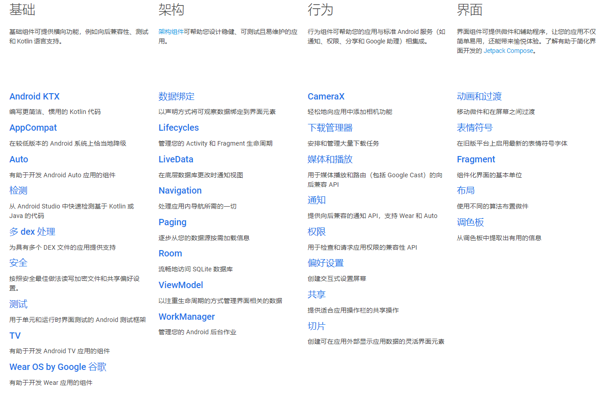
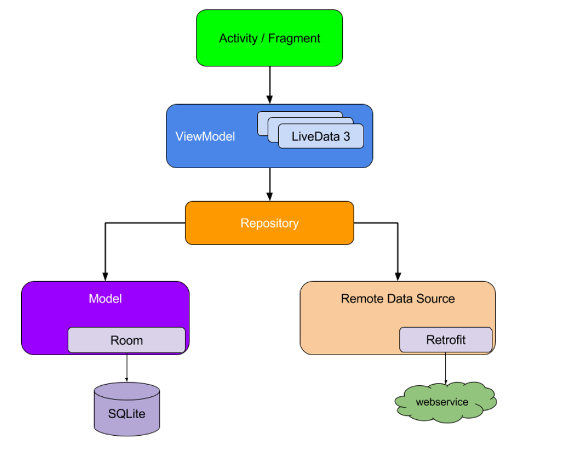
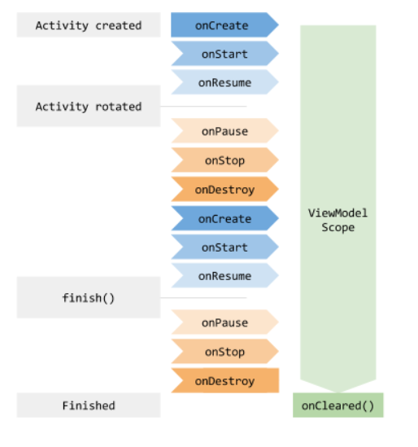
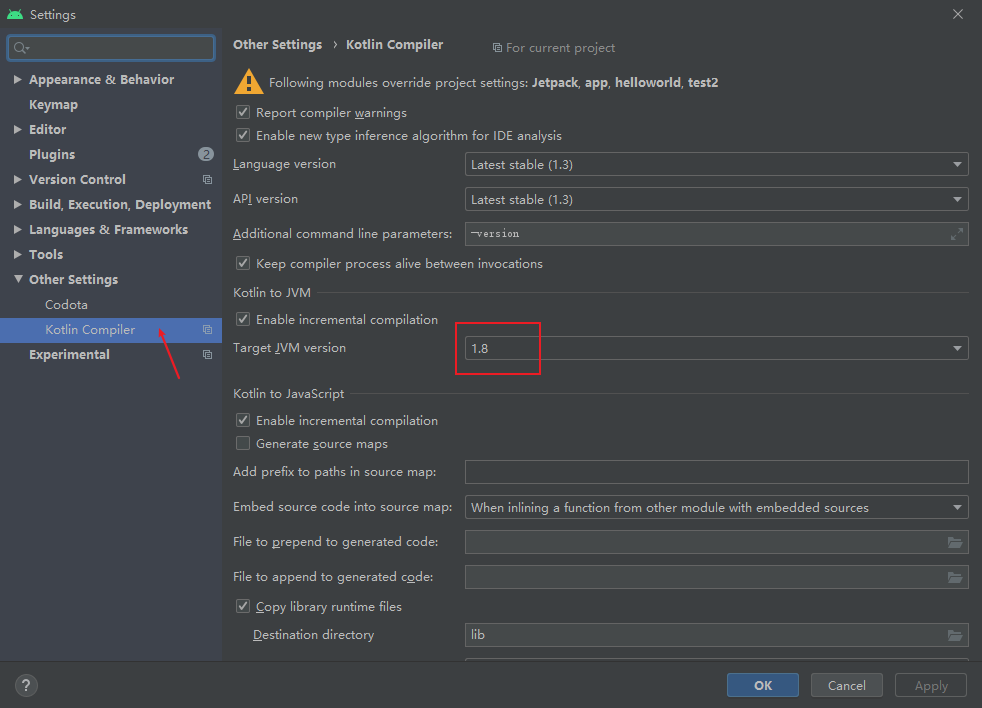
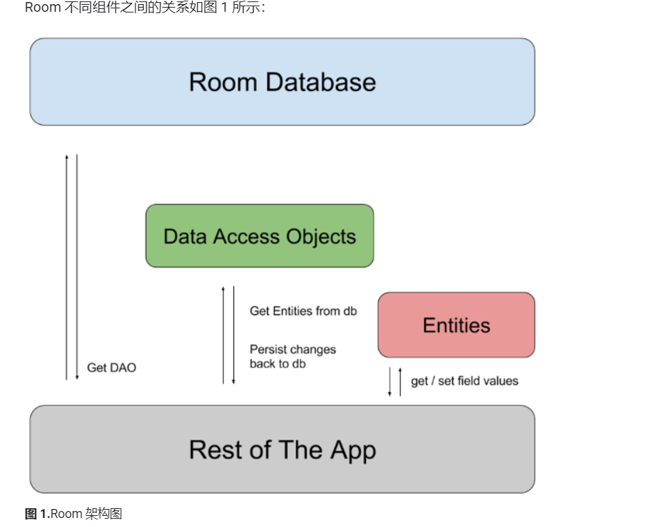

[toc]

# Jetpack简介

Jetpack是一个开发组件工具集，官网：https://developer.android.google.cn/jetpack

Jetpack 是一套库，可帮助开发人员遵循最佳实践，减少样板代码，并编写跨 Android 版本和设备一致工作的代码，以便开发人员可以专注于他们关心的代码。

Jetpack 库可以单独使用，也可以组合使用，以满足应用的不同需求。

- [WorkManager](https://developer.android.google.cn/topic/libraries/architecture/workmanager) - 满足您的后台调度需求。
- [Room](https://developer.android.google.cn/topic/libraries/architecture/room) - 实现数据存储持久性。
- [Navigation](https://developer.android.google.cn/guide/navigation/navigation-getting-started) - 管理应用导航流程。
- [CameraX](https://developer.android.google.cn/training/camerax) - 满足相机应用需求。
- 请参阅所有 Jetpack 库的[概览](https://developer.android.google.cn/jetpack/androidx/versions#version-table)。






## ViewModel

### 简介

ViewModel是Jetpack组件之一，在传统Activity中需要负责逻辑处理，又要控制UI展示，甚至还得处理网络回调，现在ViewModel将负责Activity的数据部分

当手机旋转时Activity会被重新创建，但ViewModel生命周期是Activtity创建到销毁全过程，所以旋转不会导致数据丢失

<<<<<<< HEAD

=======

>>>>>>> 4a54e0bb7a2fa4b9efd486de9e7623ed98e692bd

### 简单的计时器

1. #### 导入依赖

   ```groovy
   def lifecycle_version = "2.2.0"
       implementation "androidx.lifecycle:lifecycle-viewmodel-ktx:$lifecycle_version"
   ```

   ​	

2. #### 创建ViewModel

   ```kotlin
   import androidx.lifecycle.ViewModel
   
   class MainModel:ViewModel() {
       var counter=0
   }
   ```

3. #### 编写Activity

   ```xml
   <?xml version="1.0" encoding="utf-8"?>
   <LinearLayout xmlns:android="http://schemas.android.com/apk/res/android"
       xmlns:tools="http://schemas.android.com/tools"
       android:layout_width="match_parent"
       android:layout_height="match_parent"
       android:orientation="vertical"
       tools:context=".MainActivity">
   
   
       <TextView
           android:id="@+id/infoText"
           android:layout_width="wrap_content"
           android:layout_height="wrap_content"
           android:layout_gravity="center_horizontal"
           android:text="@string/jishi" />
   
       <Button
           android:id="@+id/plusOnBtn"
           android:layout_gravity="center_vertical"
           android:layout_width="match_parent"
           android:layout_height="wrap_content"
           android:text="@string/pulus_one" />
   </LinearLayout>
   ```

   ```kotlin
   
   package com.kj.scoreviewmodel
   
   import android.os.Bundle
   import androidx.appcompat.app.AppCompatActivity
   import androidx.lifecycle.ViewModelProviders
   import kotlinx.android.synthetic.main.activity_main.*
   
   class MainActivity : AppCompatActivity() {
   
       //定义viewmodel
       lateinit var viewModel: MainModel
   
       override fun onCreate(savedInstanceState: Bundle?) {
           super.onCreate(savedInstanceState)
           setContentView(R.layout.activity_main)
   
           //初始化viewmodel
           viewModel= ViewModelProviders.of(this).get(MainModel::class.java)
           
           //button点击事件
           plusOnBtn.setOnClickListener {
               viewModel.counter++
               refreshCounter()
           }
           refreshCounter()
   
       }
       //更新视图
       private fun refreshCounter() {
           infoText.text=viewModel.counter.toString()
       }
   }
   
   ```

### 向ViewModel传递参数

```kotlin
import androidx.lifecycle.ViewModel
//添加构造参数
class MainModel2(counter:Int): ViewModel() {
    var counter=counter
}
```

```kotlin
import androidx.lifecycle.ViewModel
import androidx.lifecycle.ViewModelProvider
//利用ViewModelProvider.Factory 接口 实现构造函数
class MainViewModelFactory(private val counter: Int) : ViewModelProvider.Factory {
    override fun <T : ViewModel?> create(modelClass: Class<T>): T {
        return MainModel2(counter) as T
    }
}
```

```kotlin
import android.content.Context
import android.content.SharedPreferences
import android.os.Bundle
import androidx.appcompat.app.AppCompatActivity
import androidx.lifecycle.ViewModelProviders
import kotlinx.android.synthetic.main.activity_main.*


class MainActivity2 : AppCompatActivity() {

    lateinit var viewModel:MainModel2
    lateinit var sp: SharedPreferences

    override fun onCreate(savedInstanceState: Bundle?) {
        super.onCreate(savedInstanceState)
        setContentView(R.layout.activity_main)

        sp=getPreferences(Context.MODE_PRIVATE)
        val countReserved=sp.getInt("count_reserved",0)

        //初始化viewmodel（修改点）
        viewModel= ViewModelProviders.of(this,MainViewModelFactory(countReserved)).get(MainModel2::class.java)

        //button点击事件
        plusOnBtn.setOnClickListener {
            viewModel.counter++
            refreshCounter()
        }
        refreshCounter()
    }

    override fun onPause() {
        super.onPause()
        sp.edit().putInt("count_reserved",viewModel.counter).apply()
    }

    //更新视图
    private fun refreshCounter() {
        infoText.text=viewModel.counter.toString()
    }
}
```

### 更正由于ViewModel 设计理念是不依赖与Activity

### 使用google推荐的写法

```kotlin
class UserProfileViewModel : ViewModel() {
   val userId : String = TODO()
   val user : User = TODO()
}
```

```kotlin
private val viewModel: UserProfileViewModel by viewModels()
```

### 遇到的错误

```
Cannot inline bytecode built with JVM target 1.8 into bytecode that is being built with JVM target
//解决
android {
    ...
    compileOptions {
        sourceCompatibility = 1.8
        targetCompatibility = 1.8
    }
 
    kotlinOptions {
        jvmTarget = "1.8"
    }
}

```



## Lifecycles

### 简介

在网络请求中，由于网络响应延迟，页面关闭情况，我们要对activity生命周期进行逻辑处理

### 监听器

```
import android.util.Log
import androidx.lifecycle.Lifecycle
import androidx.lifecycle.LifecycleObserver
import androidx.lifecycle.OnLifecycleEvent

class MyObserver(val lifecycle: Lifecycle) : LifecycleObserver {
    @OnLifecycleEvent(Lifecycle.Event.ON_START)
    fun activityStart(){
        Log.d("MyObserver", "activityStart: ")
    }
    @OnLifecycleEvent(Lifecycle.Event.ON_STOP)
    fun activityStop(){
        Log.d("MyObserver", "activityStop: ")
    }
}
```

```
//activity监听生命周期
        MyObserver(lifecycle)
        val currentState = lifecycle.currentState
        Toast.makeText(this, ""+currentState, Toast.LENGTH_SHORT).show()
```

## LiveData

[`LiveData`](https://developer.android.google.cn/reference/androidx/lifecycle/LiveData) 是一种可观察的数据存储器类。与常规的可观察类不同，LiveData 具有生命周期感知能力，意指它遵循其他应用组件（如 Activity、Fragment 或 Service）的生命周期。这种感知能力可确保 LiveData 仅更新处于活跃生命周期状态的应用组件观察者。

您可以注册与实现 [`LifecycleOwner`](https://developer.android.google.cn/reference/androidx/lifecycle/LifecycleOwner) 接口的对象配对的观察者。有了这种关系，当相应的 [`Lifecycle`](https://developer.android.google.cn/reference/androidx/lifecycle/Lifecycle) 对象的状态变为 [`DESTROYED`](https://developer.android.google.cn/reference/androidx/lifecycle/Lifecycle.State#DESTROYED) 时，便可移除此观察者。 这对于 Activity 和 Fragment 特别有用，因为它们可以放心地观察 [`LiveData`](https://developer.android.google.cn/reference/androidx/lifecycle/LiveData) 对象而不必担心泄露（当 Activity 和 Fragment 的生命周期被销毁时，系统会立即退订它们）。

- 确保界面符合数据状态
- 不会发生内存泄漏
- 不会因Activity停止导致崩溃
- 不需要手动处理生命周期
- 数据保持最新状态
- 适当的配置更改
- 共享资源

### 1.使用LiveData对象

1. 创建 `LiveData` 实例以存储某种类型的数据。这通常在 [`ViewModel`](https://developer.android.google.cn/reference/androidx/lifecycle/ViewModel) 类中完成。

2. 创建可定义 [`onChanged()`](https://developer.android.google.cn/reference/androidx/lifecycle/Observer#onChanged(T)) 方法的 [`Observer`](https://developer.android.google.cn/reference/androidx/lifecycle/Observer) 对象，该方法可以控制当 `LiveData` 对象存储的数据更改时会发生什么。通常情况下，您可以在界面控制器（如 Activity 或 Fragment）中创建 `Observer` 对象。

3. 使用 [`observe()`](https://developer.android.google.cn/reference/androidx/lifecycle/LiveData#observe(android.arch.lifecycle.LifecycleOwner, android.arch.lifecycle.Observer)) 方法将 `Observer` 对象附加到 `LiveData` 对象。`observe()` 方法会采用 [`LifecycleOwner`](https://developer.android.google.cn/reference/androidx/lifecycle/LifecycleOwner) 对象。这样会使 `Observer` 对象订阅 `LiveData` 对象，以使其收到有关更改的通知。通常情况下，您可以在界面控制器（如 Activity 或 Fragment）中附加 `Observer` 对象。

   ```kotlin
   import androidx.lifecycle.MutableLiveData
   import androidx.lifecycle.ViewModel
   
   class NameViewModel : ViewModel() {
   
       // 用字符串创建一个LiveData
       val currentName: MutableLiveData<String> by lazy {
           MutableLiveData<String>()
       }
   
       // ViewModel的其余部分…
   }
   ```

   ```kotlin
   class NameActivity : AppCompatActivity() {
   
       // 使用'by viewModels()' Kotlin属性委托
       // 来自activity-ktx工件
       private val model: NameViewModel by viewModels()
   
       override fun onCreate(savedInstanceState: Bundle?) {
           super.onCreate(savedInstanceState)
           setContentView(R.layout.activity_name)
   
           // 创建用于更新UI的观察者。
           val nameObserver = Observer<String> { newName ->
               // 更新UI，这里是TextView。
               nameTextView.text = newName
           }
   
           // 观察LiveData，将此活动作为LifecycleOwner和observer传递进来。
           model.currentName.observe(this, nameObserver)
   
           // 修改参数
           button.setOnClickListener {
               model.currentName.setValue(edText.text.toString())
               //model.currentName.postValue(edText.text.toString())
           }
   
       }
   }
   ```

### 2.map和switchMap的使用

1. 定义一个User类

   ```kotlin
   data class User(var fistName:String,var lastName:String,var age:Int)
   ```

   

2. 编写ViewModel

   ```kotlin
   class MainViewModel(countReserved:Int):ViewModel(){
   	private val userLiveData=MytableLiveData<User>()
       
       val userName:LiveData<String>=Transformations.map(userLiveData){user->
           "${user.firstName} ${user.lastName}"                                                            
       }
   }
   ```

   

3. 

## Room

[Room](https://developer.android.google.cn/training/data-storage/room) 持久性库在 SQLite 的基础上提供了一个抽象层，让用户能够在充分利用 SQLite 的强大功能的同时，获享更强健的数据库访问机制。

Room 包含 3 个主要组件：

- [**数据库**](https://developer.android.google.cn/reference/androidx/room/Database)：包含数据库持有者，并作为应用已保留的持久关系型数据的底层连接的主要接入点。

  使用 [`@Database`](https://developer.android.google.cn/reference/androidx/room/Database) 注释的类应满足以下条件：

  - 是扩展 [`RoomDatabase`](https://developer.android.google.cn/reference/androidx/room/RoomDatabase) 的抽象类。
  - 在注释中添加与数据库关联的实体列表。
  - 包含具有 0 个参数且返回使用 [`@Dao`](https://developer.android.google.cn/reference/androidx/room/Dao) 注释的类的抽象方法。

  在运行时，您可以通过调用 [`Room.databaseBuilder()`](https://developer.android.google.cn/reference/androidx/room/Room#databaseBuilder(android.content.Context, java.lang.Class, java.lang.String)) 或 [`Room.inMemoryDatabaseBuilder()`](https://developer.android.google.cn/reference/androidx/room/Room#inMemoryDatabaseBuilder(android.content.Context, java.lang.Class)) 获取 [`Database`](https://developer.android.google.cn/reference/androidx/room/Database) 的实例。

  

- [**Entity**](https://developer.android.google.cn/training/data-storage/room/defining-data)：表示数据库中的表。

- [**DAO**](https://developer.android.google.cn/training/data-storage/room/accessing-data)：包含用于访问数据库的方法。

应用使用 Room 数据库来获取与该数据库关联的数据访问对象 (DAO)。然后，应用使用每个 DAO 从数据库中获取实体，然后再将对这些实体的所有更改保存回数据库中。 最后，应用使用实体来获取和设置与数据库中的表列相对应的值。



### 简单使用

导入依赖

```kotlin
def room_version = "2.2.5"

    implementation "androidx.room:room-runtime:$room_version"
    //annotationProcessor "androidx.room:room-compiler:$room_version" // 对于Kotlin来说，使用kapt而不是annotationProcessor
    kapt "androidx.room:room-compiler:$room_version" // 对于Kotlin来说，使用kapt而不是annotationProcessor

// 可选- Kotlin扩展和协同程序支持空间
implementation "androidx.room:room-ktx:$room_version"

// 可选- RxJava支持房间
implementation "androidx.room:room-rxjava2:$room_version"

// 可选-番石榴支持房间，包括可选和ListenableFuture
implementation "androidx.room:room-guava:$room_version"

// 测试助手
testImplementation "androidx.room:room-testing:$room_version"
```

User

```kotlin
//数据库的表
@Entity
data class User(
    @ColumnInfo(name = "first_name") val firstName: String?,
    @ColumnInfo(name = "last_name") val lastName: String?
){
    @PrimaryKey(autoGenerate = true)
    var uid: Long=0
}   
```

UserDao

```kotlin
//数据访问对象
@Dao
interface UserDao {
    @Query("SELECT * FROM user")
    fun getAll(): List<User>

    @Query("SELECT * FROM user WHERE uid IN (:userIds)")
    fun loadAllByIds(userIds: IntArray): List<User>

    @Query("SELECT * FROM user WHERE first_name LIKE :first AND " +
            "last_name LIKE :last LIMIT 1")
    fun findByName(first: String, last: String): User

    @Insert
    fun insertUser(user: User):Long

    @Delete
    fun delete(user: User)
}
```

AppDatabase

```kotlin
    @Database(entities = arrayOf(User::class), version = 1)
    abstract class AppDatabase : RoomDatabase() {
        abstract fun userDao(): UserDao
    }
    
```

创建上述文件后，您可以使用以下代码获取已创建的数据库的实例：

```kotlin
//定义数据库对象，数据库版本，包含的实体类
@Database(entities = [User::class], version = 1)
abstract class AppDatabase : RoomDatabase() {
    abstract fun userDao(): UserDao

    companion object{
        private var instance: AppDatabase?=null

        @Synchronized
        fun getDatabase(context: Context): AppDatabase {
            instance?.let {
                return it
            }
            return Room.databaseBuilder(context.applicationContext,
                AppDatabase::class.java,"app_database")
                .allowMainThreadQueries()//Room默认不容许在主线程中进行数据库操作，加入这个方法可以在主线程进行数据库操作

                .build().apply {
                    instance =this
                }
        }
    }
} 
```

```xml
<?xml version="1.0" encoding="utf-8"?>
<LinearLayout xmlns:android="http://schemas.android.com/apk/res/android"
    xmlns:app="http://schemas.android.com/apk/res-auto"
    xmlns:tools="http://schemas.android.com/tools"
    android:layout_width="match_parent"
    android:layout_height="match_parent"
    android:padding="20dp"
    android:orientation="vertical"
    tools:context=".room.RoomActivity">

    <EditText
        android:id="@+id/edText"
        android:layout_width="match_parent"
        android:layout_height="wrap_content"
        android:hint="name 用空格隔开"
        android:autofillHints="姓名"
        android:inputType="text" />

    <Button
        android:id="@+id/addBtn"
        android:layout_width="match_parent"
        android:layout_height="wrap_content"
        android:text="@string/add" />

    <Button
        android:id="@+id/queryBtn"
        android:layout_width="match_parent"
        android:layout_height="wrap_content"
        android:text="@string/query_data"/>

    <Button
        android:id="@+id/updateBtn"
        android:layout_width="match_parent"
        android:layout_height="wrap_content"
        android:text="@string/update" />

    <Button
        android:id="@+id/deleteBtn"
        android:layout_width="match_parent"
        android:layout_height="wrap_content"
        android:text="@string/delete" />

    <ScrollView
        android:layout_width="match_parent"
        android:layout_height="match_parent">

        <LinearLayout
            android:layout_width="match_parent"
            android:layout_height="wrap_content"
            android:orientation="vertical">

            <TextView
                android:id="@+id/textView"
                android:layout_width="match_parent"
                android:layout_height="wrap_content"
                android:fontFamily="@font/aldrich"
                android:textSize="20sp" />
        </LinearLayout>
    </ScrollView>


</LinearLayout>
```

```kotlin
class RoomActivity : AppCompatActivity() {

    //获取数据库实例
    val userDao= AppDatabase.getDatabase(this).userDao()

    override fun onCreate(savedInstanceState: Bundle?) {
        super.onCreate(savedInstanceState)
        setContentView(R.layout.activity_room)

        addBtn.setOnClickListener {
            userDao.insertUser(User(edText.text.toString().split(" ")[0],edText.text.toString().split(" ")[1]))
        }

        updateBtn.setOnClickListener {
            userDao.upDateUser(User(edText.text.toString().split(" ")[0],edText.text.toString().split(" ")[1]))
        }

        deleteBtn.setOnClickListener {
            userDao.deleteUserByLastName(textView.text.toString())
        }

        queryBtn.setOnClickListener {
            var str=""
            for (user in userDao.getAll()){
                str+=user.toString()+"\n"
            }
            textView.text=str
        }
    }
}
```

### Room的数据库升级

添加数据库表Book

```kotlin
@Entity
data class Book(var name:String,var pages: Int) {
    @PrimaryKey(autoGenerate = true)
    var id:Long=0
}
```

BookDao

```kotlin
@Dao
interface BookDao {
    @Insert
    fun insertBook(book: Book):Long

    @Query("select * from Book")
    fun loadAllBooks(): List<Book>
}
```

```kotlin
//定义数据库对象，数据库版本，包含的实体类
//版本变成2 添加Book class
@Database(version = 2, entities = [User::class,Book::class])
abstract class AppDatabase : RoomDatabase() {
    abstract fun userDao(): UserDao
    abstract fun bookDao(): BookDao

    companion object{
        private var instance: AppDatabase?=null

        val MIGRATION_1_2=object : Migration(1,2){
            override fun migrate(database: SupportSQLiteDatabase) {
                database.execSQL("create table Book (" +
                        "id integer primary key autoincrement not null," +
                        "name text not null," +
                        "pages integer not null)")
            }
        }

        @Synchronized
        fun getDatabase(context: Context): AppDatabase {
            instance?.let {
                return it
            }
            return Room.databaseBuilder(context.applicationContext,
                AppDatabase::class.java,"app_database")
                .allowMainThreadQueries()//Room默认不容许在主线程中进行数据库操作，加入这个方法可以在主线程进行数据库操作
                .addMigrations(MIGRATION_1_2)//添加数据表
                .build().apply {
                    instance =this
                }
        }
    }
}
```

## WorkManager 调度任务 

使用 WorkManager API 可以轻松地调度即使在应用退出或设备重启时仍应运行的可延迟异步任务。

**主要功能**：

- 最高向后兼容到 API 14
  - 在运行 API 23 及以上级别的设备上使用 JobScheduler
  - 在运行 API 14-22 的设备上结合使用 BroadcastReceiver 和 AlarmManager
- 添加网络可用性或充电状态等工作约束
- 调度一次性或周期性异步任务
- 监控和管理计划任务
- 将任务链接起来
- 确保任务执行，即使应用或设备重启也同样执行任务
- 遵循低电耗模式等省电功能

WorkManager 旨在用于**可延迟**运行（即不需要立即运行）并且在应用退出或设备重启时必须能够**可靠运行**的任务。例如：

- 向后端服务发送日志或分析数据
- 定期将应用数据与服务器同步

WorkManager 不适用于应用进程结束时能够安全终止的运行中后台工作，也不适用于需要立即执行的任务。请查看[后台处理指南](https://developer.android.google.cn/guide/background)，了解哪种解决方案符合您的需求。

### WorkManger基本用法

#### 添加依赖

```groovy
def work_version = "2.3.4"

        // (Java only)
        implementation "androidx.work:work-runtime:$work_version"

        // Kotlin + coroutines
        implementation "androidx.work:work-runtime-ktx:$work_version"

        // optional - RxJava2 support
        implementation "androidx.work:work-rxjava2:$work_version"

        // optional - GCMNetworkManager support
        implementation "androidx.work:work-gcm:$work_version"

        // optional - Test helpers
        androidTestImplementation "androidx.work:work-testing:$work_version"
```

#### 创建后台任务

```kotlin
class SimpleWorker(context: Context,params: WorkerParameters): Worker(context,params) {
    override fun doWork(): Result {
        //耗时操作
        Log.d("SimpleWorker", "doWork: do work in SimpleWorker")
        return Result.success()
    }
}
```

```kotlin
button.setOnClickListener {
            val request=OneTimeWorkRequest.Builder(SimpleWorker::class.java)
                .setInitialDelay(5,TimeUnit.MINUTES)//设置5分钟后运行
                .addTag("simple")//添加请求标签，
                .build()
            WorkManager.getInstance(this).enqueue(request)
        }
```

