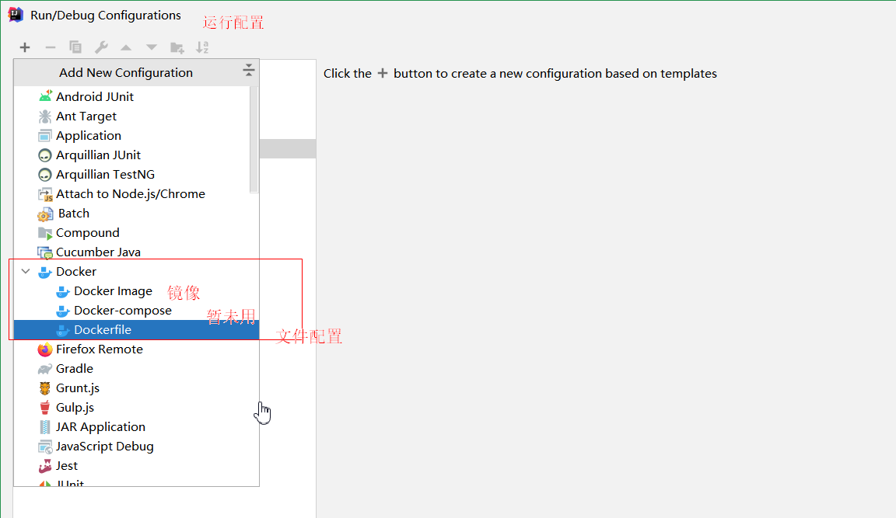

# 利用Docker远程部署到Centos7

> 前提： 
>
> ​			Rider（idea）：2020.3.x
>
> ​			Docker: 官网下载安装即可
>
> ​			Centos：7-8 （我这里使用的华为云服务器）

## 安装

https://docs.docker.com/get-docker/

### 华为云-Centos7-8(版本)

- 安装命令

  - 卸载旧版本

    ```bash
    sudo yum remove docker \
                      docker-client \
                      docker-client-latest \
                      docker-common \
                      docker-latest \
                      docker-latest-logrotate \
                      docker-logrotate \
                      docker-engine
    ```

    - ###### 利用存储库安装

    ```shell
     sudo yum install -y yum-utils
     sudo yum-config-manager \
        --add-repo \
        https://download.docker.com/linux/centos/docker-ce.repo
    sudo yum install docker-ce docker-ce-cli containerd.io
    ```

    - 启动验证

      ```shell
      #开启docker服务
      sudo systemctl start docker
      sudo docker run hello-world
      #无错误提示，即完成
      ```

- 卸载（可选）

  ```shell
  #卸载码头发动机、CLI 和容器包装：
  sudo yum remove docker-ce docker-ce-cli containerd.io
  #主机上的图像、容器、卷或自定义配置文件不会自动删除。要删除所有图像、容器和卷：
  sudo rm -rf /var/lib/docker
  	sudo rm -rf /var/lib/containerd
  ```

### 远程服务器设置

> 需要修改 Docker 配置文件让其开放 Docker Remote API （docker REST API）

查看配置文件位于哪里：

```text
 [root@localhost ~]# systemctl show --property=FragmentPath docker
 FragmentPath=/usr/lib/systemd/system/docker.service
 [root@localhost ~]# whereis dockerd
 dockerd: /usr/bin/dockerd /usr/share/man/man8/dockerd.8.gz
```

编辑该文件：

```text
 [root@localhost ~]# vi /usr/lib/systemd/system/docker.service
```

在该行添加如下内容：(这里端口为2375，所以后面在idea中连接时也要填写该端口)

```text
 ExecStart=/usr/bin/dockerd -H unix:///var/run/docker.sock -H tcp://0.0.0.0:2375
```


重新加载配置文件：

```text
 [root@localhost ~]# systemctl daemon-reload
```

重启docker：

```text
 [root@localhost ~]# systemctl restart docker
```

### 开放远程接口

```bash
firewall-cmd --zone=public --list-ports #查看防火墙开放的端口
firewall-cmd --zone=public --add-port=2357/tcp --permanent
firewall-cmd --reload   # 配置立即生效
firewall-cmd --zone=public --list-ports
```


### 华为云需要开放端口

​	添加安全组规则

	

关联实例

​	

## IDEA使用Docker

https://www.jetbrains.com/help/idea/2021.1/docker.html

> 自带Docker插件，没有可以下载



在 Tomcat 服务器容器内部署 Java 网络应用程序


## Rider配置Docker


https://github.com/kujin521/Asp.netMvc_App_Docker_Demo