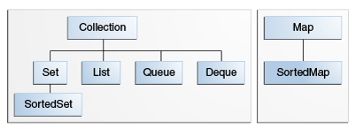

# 集合-接口简介

*核心集合接口*封装不同类型的集合，如下图所示。这些接口允许独立于其表示的详细信息进行集合操作。核心集合接口是 Java 集合框架的基础。如下图所示，核心集合接口形成层次结构。

核心集合接口。

- Collection 集合中的根接口
- Set  不包含重复元素的集合
- List  有序序列 通过整数索引查询元素
- Map 键值对映射
  - HashMap
  - TreeMap
  - 
- Queue  用于在处理之前保存多个元素的集合
- Deque 用于在处理之前保存多个元素的集合
- SortedSet 默认升序排序集
- SortedMap 排序的映射用于按自然顺序收集键/值对

