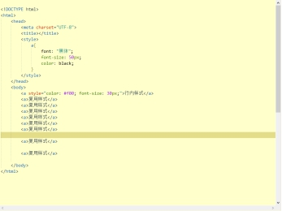
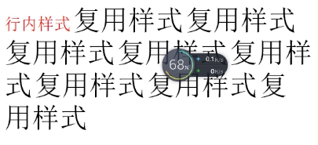

# CSS

## css简述

## css是什么？有什么作用？

CSS 指层叠样式表 (Cascading Style Sheets)

样式定义如何显示 HTML 元素

样式通常存储在样式表中

把样式添加到 HTML 4.0 中，是为了解决内容与表现分离的问题

外部样式表可以极大提高工作效率

外部样式表通常存储在 CSS 文件中

多个样式定义可层叠为一

 

## css入门案例

步骤1：创建一个HTML文件

步骤2：在HTML上创建一个字体标签

步骤3：字体标签增加一个style属性，并修改style属性值

为什么使用css代替html属性设置样式

因为html具有局限性，所以需要配合css样式展示多样化，丰富的效果

css代码规范

放置规范：

在<style>标签内容中书写css样式代码

<style>标签放置在<head>标签中


格式规范：

选择器名称｛属性名：属性值；属性名：属性值；。。。。。｝

选择器：既指定css样式作用在那些html标签上

 

代码规范：

属性名和属性值之间是键值关系

属性名和属性值之间用 : 连接，最后 ； 结尾

css选择器

基本选择器

元素选择器

html标签又称html元素

元素选择器：既html标签名为选择器名称

格式:

标签名｛

/*css样式代码*/

｝

适用范围：适用于将相同样式 作用在同名标签上	

类选择器

每个html标签都有一个class属性，class属性值即为类名

类选择器：既以html的类名 作为选择器名称

作用：选择css样式代码作用于对应类名html标签

 

格式：	

.类名,.类名｛

/*css样式*/

｝

适用范围：相同类名上

id选择器

每个html都有一个id属性，id属性值必须在本页面是惟一的

id选择器既以html的ID作为选择器名称

作用：选择css样式代码作用于某个规定id值的html标签上

格式：

\#id值｛

/*css样式*/

｝

适用范围：作用于某个标签

注意：为了开发的严谨性 id必须保证唯一性

基本选择器的组合方式

层级关系

标签和标签之间有层级关系

我们可以对选择器进行组合，表现出层级关系

格式：

选择器1 选择器2。。。｛

/*css样式代码*/

｝

选择器1下的选择器2

css样式

边框属性

所有的html标签都有边框 默认边框不可见

border

设置边框样式

格式：宽度 样式 颜色

例border：2px solid red ，1像素宽的实线 红色边框

线条样式：	solid实线 none 无边 double 双线

width

设置标签的宽度

height

设置标签的高度

background-color

用于设值标签的背景颜色

背景颜色设置的两种主流方式

1英文单词		例如：red blue yellow

2颜色代码		格式:#红绿蓝 每个颜色用两个16制位数表示

例如：#ff1100 红色ff 绿色11 蓝色00，红色颜色最重，绿色其次，没有蓝色

布局

float

通常默认排版方式，将页面的元素从上到下一一罗列，而实际开发中需要左右方式进行排版，就需要使用浮动属性

格式:

选择器｛float：属性值｝

常用属性值

none 元素不浮动（默认值）

left 元素左浮动

right 元素右浮动

注意：因为元素设置了浮动属性后会脱离原有的文档流，从而影响其他元素样式，所以设置浮动以后，页面需要重新调整

转换	

###  display

html提供丰富的标签，这些标签被定义为不同的类型 一般分为 块级标签和行内标签

块元素：以区域块方式出现。每块标签独自占用一整行或多整行，块结束会自动换行	常见块元素：h1 p div ul等

行内元素：根据内容的多少来占用空间 不会自动换行

常见行元素：《span》 《a》等

display属性 可以使得元素 在行元素和块元素之间相互转换

display:inline;//行级元素

display: block；//块级元素

 

### 字体

font-size

用于设置字体大小

color

设置字体颜色

css盒子模型

什么是盒子模型

所有的HTML元素，都可以看成四边形，即一个盒子

用css来设置元素盒子内边距，边框，外边距的样式

相当于盒子的样式，所以我们将其称之为盒子模型

 

### 边框

边框：HTML元素盒子的框体

HTML元素

border-top

border-left

border-right

border-bottom

例：border-top: 1px solid red;

内边距 padding

内边距：html内容体到html元素边框的距离

padding-top

padding-left

padding-right

padding-bottom

例：			padding-top: 200px;

​				padding-bottom: 100px;

外边距 margin

外边距：html元素边框 到 其他html元素边框的距离

margin-top

margin-left

margin-right

margin-bottom

css和html结合方式

内部样式

行内样式

行内样式是通过标签的style属性来设置元素样式

S格式：

<html 标签 style=“css样式代码”/>

示例：

```css
<a style="color: #f00; font-size: 30px;">行内样式</a>
```

 

<style></style>标签样式

当某样样式在页面中被多个标签重复使用， 为了使编码更加灵活，避免书写重复代码

我们将样式代码代码从标签style属性中抽取出来，统一写入到style标签中

格式：

```css
<style>

	css样式

</style>
```

示例：

 

 

使用范围：页面复用标签样式

### 外部样式

<link/> 标签方式

链入式，将所有样式放在一个或多个.css为扩展名的文本样式文件中

通过<link>标签将样式连接到html文档中

格式：

```css
<link rel="stylesheet" type="text/css" href="deno1.css" />
```

rel="stylesheet"固定值 样式表

type="text/css" 固定值 标识css类型

href="deno1.css" 文件位置

 

 

 

 