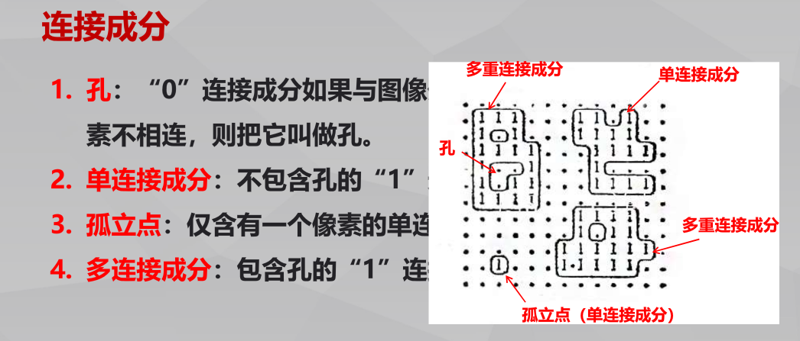

## 1. 二值图像的连接性

### 领域:

> 对于任意像素(i，j)，把像素的集合｛（i+p,j+q）｝
> （p, q是一对适当的整数）叫做像素(i，j)的邻域，即像素（i, j）附近的像素形成的区域。
>
> 最常采用的是4-邻域和8-邻域。

### 像素的连接

> 在二值图像中，具有两个相同数值的像素a1和a2，若所有与它们具有相同值的像素，能够在4-/8-邻域内
> 构成一个从a1到a2的邻接的像素序列，则我们把像素a1和a2叫做4-/8-连接。其像素序列叫做4-/8-路径。

### 连接成分

> 在二值图像中，把互相连接的像素的集合汇集为一组。
> 这些具有若干个0像素和具有若干个1像素的组叫做**连接成分**。

### 像素的连接数

> 一个像素的连接数可以通过考察以该像素为中心的3×3 像素区域获取，
>
> 其所代表的含义是通过该像素所连接的**像素联通区域的个数**。
>
> 对于同一图像，在4-邻接或8-邻接的情况下，各像素的连接数是不同的。

### 按照连接数Nc(p)不同可将像素分为以下几种：

1）孤立点：B( p) =1的像素P，在4-/8-邻接的情况下，当其4-/8-邻接的像素全是0 时，像素P叫做孤立点。孤立点的连接数Nc( p) = 0。

2）内部点：B( p) =1的像素p，在4-/8-邻接的情况下，当其4-/8-邻接的像素全是1 时，像素p 叫做内部点。内部点连接数Nc( p) = 0。

3）边界点：在B( p) =1的像素中，把除了孤立点和内部点以外的点叫做边界点。在边界点中，1≤Nc ( p)≤4。

4）背景点：把B( p) = 0的像素叫做背景点。
	与图像外围的1 行1 列的0 像素不相连接的像素p叫做孔。
	与图像外围的1 行1 列的0 像素相连接的像素p叫做背景。

## 2. 连接成分的标记

### 原理

> 对属于同一个1 像素连接成分的所有像素分配相同的编号，对不同的连接成分分配不同的编号的操作，叫做连接成分的标记。

### 算法

> 顺序扫描和并行传播组合：对图像按照从上到下、从左至右的顺序进行扫描，发现没有分配标号的1 像素，对这个像素，分配给它还没有使用过的标号，对位于这个像素8-邻域内的1 像素也赋予同一标号，然后对位于各个标号像素8-邻域内的1 像素也赋予同一标号。

## 3. 腐蚀与膨胀

### 腐蚀

> 腐蚀（erosion）是一种消除连通域的边界点，使边界向内收缩的处理。可以将粘连在一起的不同目标物分离，并可以将小的颗粒噪声去除。

### 膨胀

> 膨胀（dilation）是将与目标区域的背景点合并到该目标物中，使目标物边界向外部扩张的处理。
> 可以将断裂开的目标物进行合并，便于对其整体的提取。

## 4. 开运算和闭运算

### 定义

> 一般情况下，膨胀与腐蚀并不互为逆运算，所以它们可以级连结合使用。
>
> 腐蚀后再膨胀称为**开运算**，或者膨胀后再腐蚀称为**闭运算**。
> 注意：进行的腐蚀和膨胀运算必须使用同一个结构元素。

## 案例

一个二值图像如图1示（1代表黑，0代表白）

(1)计算所给图中的连通域个数？（分别用4连接求8连接求）( 4分)

| 1    | 1    | 0    | 1    | 1    | 0    |
| ---- | ---- | ---- | ---- | ---- | ---- |
| 1    | 1    | 0    | 1    | 1    | 0    |
| 0    | 0    | 1    | 0    | 0    | 0    |
| 0    | 0    | 0    | 0    | 0    | 0    |
| 0    | 1    | 1    | 0    | 1    | 1    |
| 0    | 1    | 1    | 1    | 0    | 0    |

图1

（2）对图1进行闭运算，结构元素如图2所示（<1>为原点）。边缘点的处理采用保留原值的方法。（6分）

| <1>  | 0    |
| ---- | ---- |
| 1    | 1    |

图2

