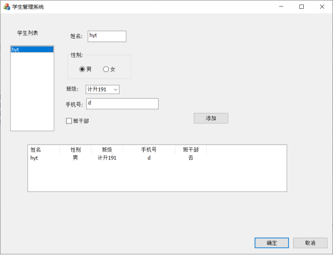

# 实验一名称：VC++应用

## 实验介绍

### 1.1 实验内容

设计实现一个学生信息管理程序，在学生列表中选中一名学生，该学生的详细信息就会显示在列表控件中。

### 1.2 实验目的

能够创建项目与解决方案， 掌握消息与响应的创建方法，熟悉对话框的创建，掌握常用控件的使用，熟悉菜单栏与工具栏。

### 1.3 实验要求

程序中需要使用静态文本控件、列表框控件、编辑框控件、组框控件、单选按钮控件、组合框控件、复选框控件、列表框控件等常用控件。

运行界面中，要有学生列表、姓名、性别、班级、电话、是否是班干部、详细信息列表等条目。

## 相关知识点

### 2.1 基础知识点

创建项目与解决方案，对话框的创建，菜单栏与工具栏

### 2.2 扩展知识点

常用控件列表

-------------------------- ---------------------------------------------------------------- ------------
  控件名称                   功能                                                             对应控件类
  静态文本（Static Text）    显示文本，一般不能接受输入信息                                   CStatic
  命令按钮（Button）         响应用户的输入，触发相应的事件                                   CButton
  编辑框（Edit Control）     输入并编辑文本，支持单行和多行输入                               CEdit
  复选框（Check Box）        用作选择标记，有选中和不选中两种状态                             CButton
  列表框（List Box）         显示一个列表，用户可以从中选择一项或多项                         CListBox
  组合框（Combo Box）        是一个编辑框和一个列表框的组合。分为简易式、下拉式和下拉列表。   CComboBox
  单选按钮（Radio Button）   用来从两个或多个选项中选择一个                                   CButton
  组框（Group Box）          显示文本和方框，主要用来将相关的一些控件聚成一组                 CButton
  图片（Picture Control）    显示位图、图标、方框和图元文件                                   CStatic
-------------------------- ---------------------------------------------------------------- ------------

## 实验步骤

### 3.1创建对话框

新建一个MFC项目，选择"基于对话框"的应用程序类型，创建成功后打开对话框窗口。

选择MFC应用

如果没有该选项 修改安装选项

应用类型选择基于对话框

### 3.2 添加控件

添加的控件及功能：

静态文本：用来提示用户；

列表框：用来显示学生姓名；

编辑框：用来输入学生姓名和电话；

组框和单选按钮：用来选择学生性别；

组合框：用来选择学生所在班级；

复选框：用来选择是否是班干部；

列表框：用来显示学生详细信息。

在工具箱 找控件

---------------- ------------------------ ---------------------------------------
  控件名称         作用                     修改项,ID命名
  List Box         存放学生列表             Caption
  static Test      静态文本                 Caption
  Editor Control   编辑文本框               
  Radio Button     单选按钮                 将其中一个Group属性改为true
  Group Box        将两个单选框包裹成一组   Caption
  Combo Box        下拉框                   Data 选项用分号隔开 Sort 受否自动排序
  Check Box        选择框                   
  List Control     显示列表                 
                                            
---------------- ------------------------ ---------------------------------------

基本界面

添加变量

关联代码,通过访问变量,增加功能

选中List Box 学生列表 右键 添加控件变量

单选按钮添加一个变量

班级

查看类视图 ,可以看到代码

### 3.3 添加源代码

**为每个控件添加变量**： "类别""变量类型""变量名"；

**定义一个结构体，用来存储输入的学生信息；**

**为List Control控件添加表头；**

**添加全局变量"g_icount"；**

**为"确定"按钮添加消息响应函数：**获取输入的学生姓名、性别、班级、电话、是否是班干部等信息。

**为"List Box"添加消息响应函数。**

#### 3.3.1 添加表头

类视图--\>对话框类 xxxDlg双击 xxx.cpp 文件

    // TODO: 在此添加额外的初始化代码
    //添加表头
    m_stdView.InsertColumn(0, _T("姓名"), LVCFMT_CENTER, 90);
    m_stdView.InsertColumn(1, _T("性别"), LVCFMT_CENTER, 90);
    m_stdView.InsertColumn(2, _T("班级"), LVCFMT_CENTER, 90);
    m_stdView.InsertColumn(3, _T("手机号"), LVCFMT_CENTER, 150);
    m_stdView.InsertColumn(4, _T("班干部"), LVCFMT_CENTER, 90);
    //显示模式 报告模式
    m_stdView.ModifyStyle(0, LVS_REPORT);

#### 3.3.2 添加一个Button

双击按钮,添加响应函数

添加头文件 xx.h 头文件代码

    using namespace std;
    //定义结构体
    typedef struct tag_Student 
    {
    	CString m_Name;
    	CString m_Gender;
    	CString m_Class;
    	CString m_Phone;
    	CString m_IsLeader;
    	//Student 别名
    }Student;
    ....其他代码 ...
    public:
    	//定义结构体数组
    	Student m_stStudent[10];
    	int m_count;

在xx.cpp 构造函数里初始化

    /*
    	构造函数
    */
    CStdManaerDlg::CStdManaerDlg(CWnd* pParent /*=nullptr*/)
    	: CDialogEx(IDD_STDMANAER_DIALOG, pParent)
    	, m_name(_T(""))
    	, m_gender(0)
    	, m_class(_T(""))
    	, m_phone(_T(""))
    {
    	m_hIcon = AfxGetApp()->LoadIcon(IDR_MAINFRAME);
    	//手动初始化
    	m_count = 0;
    
    }

双击添加 ,进入代码页面,编写代码

    /*
    	点击添加 按钮 事件
    */
    void CStdManaerDlg::OnBnClickedAdd()
    {
    	// TODO: 在此添加控件通知处理程序代码
    	UpdateData(true);
    	m_stStudent[m_count].m_Name = m_name;
    	if (m_gender == 0) {
    		m_stStudent[m_count].m_Gender = "男";
    	}
    	else {
    		m_stStudent[m_count].m_Gender = "女";
    	}
    	m_stStudent[m_count].m_Class = m_class;
    	m_stStudent[m_count].m_Phone = m_phone;
    	if (m_isLeader.GetCheck()) {
    		m_stStudent[m_count].m_IsLeader = "是";
    	}
    	else {
    		m_stStudent[m_count].m_IsLeader = "否";
    	}
    	m_stdList.AddString(m_stStudent[m_count].m_Name);
    	m_count = (m_count + 1) % 10;
    }

#### 3.3.3 点击学生列表 显示学生信息

选中学生列表框 右键 添加事件处理程序

具体代码

    void CStdManaerDlg::OnLbnSelchangeStudentlist()
    {
    	// TODO: 在此添加控件通知处理程序代码
    	int index = m_stdList.GetCurSel();
    	m_stdView.DeleteAllItems();
    	m_stdView.InsertItem(0, m_stStudent[index].m_Name);
    	m_stdView.SetItemText(0, 1, m_stStudent[index].m_Gender);
    	m_stdView.SetItemText(0, 2, m_stStudent[index].m_Class);
    	m_stdView.SetItemText(0, 3, m_stStudent[index].m_Phone);
    	m_stdView.SetItemText(0, 4, m_stStudent[index].m_IsLeader);
    }

效果图

