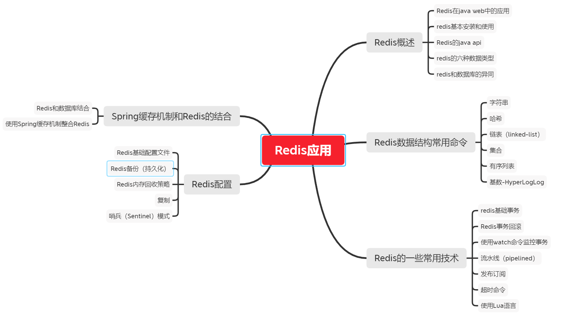
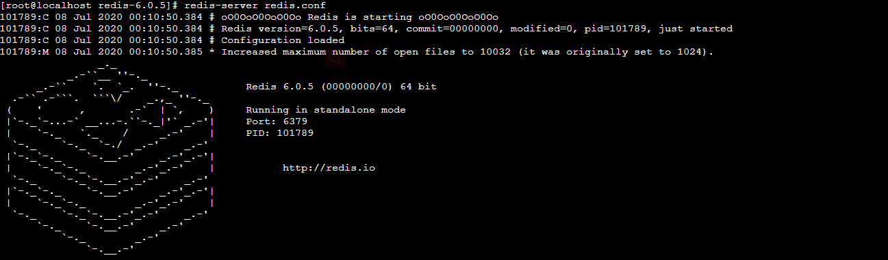
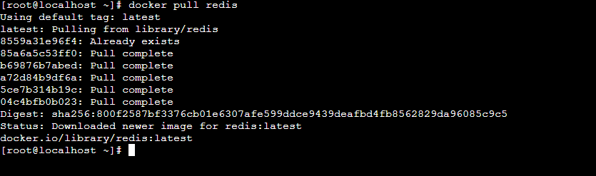

# Redis简介

Redis（Remote Dictionary Service）是一个NoSql数据库，基于c开发，键值对存储数据，单线程结构, 分布式锁,运行在缓存内存中，高速缓存数据

特点：

- 支持数据持久化
- 支持多种不同的数据结构
- 支持从模式的数据备份
- 自带发布订阅系统
- 定时器，计数器

应用场景

- 记录帖子的点赞数 评论数 和点击数(hash)
- 记录用户的帖子ID列表(排序) 便于快速显示用户帖子列表(zset)



# 安装-启动

## Redis安装方式

官网：https://redis.io/

官方文档：https://redis.io/documentation

### 1. 编译安装

(直接，不过gcc环境太麻烦，还容易出错)

#### 准备好gcc环境

```
yum install -y cpp
yum install -y binutils
yum install -y glibc
yum install -y glibc-kernheaders
yum install -y glibc-common
yum install -y glibc-devel
yum install -y gcc
yum install -y make
# 升级gcc
yum -y install centos-release-scl
yum -y install devtoolset-9-gcc devtoolset-9-gcc-c++ devtoolset-9-binutils
scl enable devtoolset-9 bash
```

#### 下载， 解压，编译，安装


```shell
wget http://download.redis.io/releases/redis-6.0.5.tar.gz
tar xzf redis-6.0.5.tar.gz
cd redis-6.0.5
make
# 注意 如果提示错误 In file included from adlist.c:34:0: zmalloc.h:50:31: fatal error: jemalloc/
# 执行 make MALLOC=libc
make install
```

#### 运行

```shell
redis-server redis.conf
```




### 2. 使用Docker安装

（提前安装运行docker）

```shell
docker pull redis
```



#### 创建配置文件

当前目录下创建redis文件夹,redis目录下创建 redis.conf 

 redis.conf 设置配置信息

```groovy
#修改为守护模式
daemonize yes
#设置进程锁文件
pidfile redis/redis.pid
#端口
port 6379
#客户端超时时间
timeout 300
#日志级别
loglevel debug
#日志文件位置
logfile redis/log-redis.log
#设置数据库的数量，默认数据库为0，可以使用SELECT <dbid>命令在连接上指定数据库id
databases 8
##指定在多长时间内，有多少次更新操作，就将数据同步到数据文件，可以多个条件配合
#save <seconds> <changes>
#Redis默认配置文件中提供了三个条件：
save 900 1
save 300 10
save 60 10000
#指定存储至本地数据库时是否压缩数据，默认为yes，Redis采用LZF压缩，如果为了节省CPU时间，
#可以关闭该#选项，但会导致数据库文件变的巨大
rdbcompression yes
#指定本地数据库文件名
dbfilename dump.rdb
#指定本地数据库路径
dir redis/db/
#指定是否在每次更新操作后进行日志记录，Redis在默认情况下是异步的把数据写入磁盘，如果不开启，可能
#会在断电时导致一段时间内的数据丢失。因为 redis本身同步数据文件是按上面save条件来同步的，所以有
#的数据会在一段时间内只存在于内存中
appendonly no
#指定更新日志条件，共有3个可选值：
#no：表示等操作系统进行数据缓存同步到磁盘（快）
#always：表示每次更新操作后手动调用fsync()将数据写到磁盘（慢，安全）
#everysec：表示每秒同步一次（折衷，默认值）
appendfsync everysec
#redis配置外网访问：
protected-mode no
#配置密码
requirepass root
```

#### 运行容器

```shell
docker run -p 6379:6379 --name redis -v $PWD/redis.conf:/root/redis/redis.conf -v $PWD/data:/root/redis/data -d redis redis-server
```

#### 进入容器并开启客户端查看redis信息

```shell
docker exec -it myredis redis-cli
```


# Redis基础数据结构


| 数据类型         | 数据类型存储的值                                             | 说明                                                         |
| ---------------- | ------------------------------------------------------------ | ------------------------------------------------------------ |
| String 字符串    | 保存字符串.整数, 浮点数                                      | 可以对字符串进行操作,增加字符串或求子串,如果时整数或者浮点数,可以计算,比如自增 |
| List 列表        | 它是一个链表,每一个节点都包含字符串                          | Redis支持从链表的两端插入                                    |
| set 集合         | 它是一个收集器, 但是是无序的,它里面每一个元素都是字符串,而且是独一无二的,各不相同 | 可以新增,读取,删除删除单个元素,检测一个元素是否在集合中,计算和其他集合的交集,并集,和差集等;随机从集合中读取元素 |
| Hash 哈希散列表  | 它类似于java语言中map 是一个键值对应的无序列表               | 可以增删改查单个键值对,也可以获取所有的键值对                |
| Zset 有序集合    | 可以包含字符串,整数,浮点数,分值(score),元素的排列是依据分值的大小决定的 | 可以增删改查元素,根据分值的范围或成员来获取键值对            |
| HyperLogLog 基数 | 计算重复的值,以确定存储的数量                                | 只提供基数的运算,不提供返回的功能                            |


