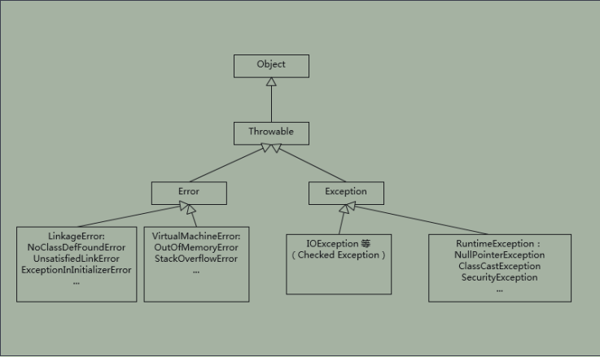
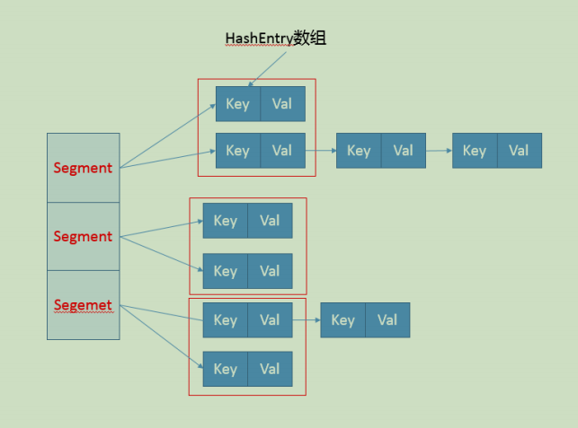

# 第一讲 Java平台的理解

## 典型回答

Java 本身是一种面向对象的语言，最显著的特性有两个方面，一是所谓的“书写一次，到处运行”（Write once, run anywhere），能够非常容易地获得跨平台能力；另外就是垃圾收集（GC, Garbage Collection），Java 通过垃圾收集器（Garbage Collector）回收分配内存，大部分情况下，程序员不需要自己操心内存的分配和回收。

我们日常会接触到 JRE（Java Runtime Environment）或者 JDK（Java Development Kit）。

JRE，也就是 Java 运行环境，包含了 JVM 和 Java 类库，以及一些模块等。而 JDK 可以看作是

JRE 的一个超集，提供了更多工具，比如编译器、各种诊断工具等。

对于“Java 是解释执行”这句话，这个说法不太准确。我们开发的 Java 的源代码，首先通过Javac 编译成为字节码（bytecode），然后，在运行时，通过 Java 虚拟机（JVM）内嵌的解释器将字节码转换成为最终的机器码。但是常见的 JVM，比如我们大多数情况使用的 Oracle JDK提供的 Hotspot JVM，都提供了 JIT（Just-In-Time）编译器，也就是通常所说的动态编译器，

JIT 能够在运行时将热点代码编译成机器码，这种情况下部分热点代码就属于编译执行，而不是解释执行了。

## 考点分析

其实这个问题，问得有点笼统。题目本身是非常开放的，往往考察的是多个方面，比如，基础知识理解是否很清楚；是否掌握 Java 平台主要模块和运行原理等。很多面试者会在这种问题上吃亏，稍微紧张了一下，不知道从何说起，就给出个很简略的回答。

对于这类笼统的问题，你需要尽量表现出自己的思维深入并系统化，Java 知识理解得也比较全面，一定要避免让面试官觉得你是个“知其然不知其所以然”的人。毕竟明白基本组成和机制，是日常工作中进行问题诊断或者性能调优等很多事情的基础，相信没有招聘方会不喜欢“热爱学习和思考”的面试者。

即使感觉自己的回答不是非常完善，也不用担心。我个人觉得这种笼统的问题，有时候回答得稍微片面也很正常，大多数有经验的面试官，不会因为一道题就对面试者轻易地下结论。通常会尽量引导面试者，把他的真实水平展现出来，这种问题就是做个开场热身，面试官经常会根据你的回答扩展相关问题。

## 知识扩展

回归正题，对于 Java 平台的理解，可以从很多方面简明扼要地谈一下，例如：Java 语言特性，包括泛型、Lambda 等语言特性；基础类库，包括集合、IO/NIO、网络、并发、安全等基础类库。对于我们日常工作应用较多的类库，面试前可以系统化总结一下，有助于临场发挥。

或者谈谈 JVM 的一些基础概念和机制，比如 Java 的类加载机制，常用版本 JDK（如 JDK 8）内嵌的 Class-Loader，例如 Bootstrap、 Application 和 Extension Class-loader；类加载大致过程：加载、验证、链接、初始化（这里参考了周志明的《深入理解 Java 虚拟机》，非常棒的 JVM 上手书籍）；自定义 Class-Loader 等。还有垃圾收集的基本原理，最常见的垃圾收集器，如 SerialGC、Parallel GC、 CMS、 G1 等，对于适用于什么样的工作负载最好也心里有数。这些都是可以扩展开的领域，我会在后面的专栏对此进行更系统的介绍。

当然还有 JDK 包含哪些工具或者 Java 领域内其他工具等，如编译器、运行时环境、安全工具、诊断和监控工具等。这些基本工具是日常工作效率的保证，对于我们工作在其他语言平台上，同样有所帮助，很多都是触类旁通的。

下图是我总结的一个相对宽泛的蓝图供你参考。教程由www.52programer.com社区用户整理分享不再扩展了，回到前面问到的解释执行和编译执行的问题。有些面试官喜欢在特定问题上“刨根问底儿”，因为这是进一步了解面试者对知识掌握程度的有效方法，我稍微深入探讨一下。

众所周知，我们通常把 Java 分为编译期和运行时。这里说的 Java 的编译和 C/C++ 是有着不同的意义的，Javac 的编译，编译 Java 源码生成“.class”文件里面实际是字节码，而不是可以

直接执行的机器码。Java 通过字节码和 Java 虚拟机（JVM）这种跨平台的抽象，屏蔽了操作系统和硬件的细节，这也是实现“一次编译，到处执行”的基础。

在运行时，JVM 会通过类加载器（Class-Loader）加载字节码，解释或者编译执行。就像我前面提到的，主流 Java 版本中，如 JDK 8 实际是解释和编译混合的一种模式，即所谓的混合模式（-Xmixed）。通常运行在 server 模式的 JVM，会进行上万次调用以收集足够的信息进行高效的编译，client 模式这个门限是 1500 次。

Oracle Hotspot JVM 内置了两个不同的 JITcompiler，C1 对应前面说的 client 模式，适用于对于启动速度敏感的应用，比如普通 Java 桌面应用；C2 对应 server 模式，它的优化是为长时间运行的服务器端应用设计的。默认是采用所谓的分层编译（TieredCompilation）。这里不再展开更多 JIT 的细节，没必要一下子就钻进去，我会在后面介绍分层编译的内容。

Java 虚拟机启动时，可以指定不同的参数对运行模式进行选择。 比如，指定“-Xint”，就是告诉 JVM 只进行解释执行，不对代码进行编译，这种模式抛弃了 JIT 可能带来的性能优势。毕竟解释器（interpreter）是逐条读入，逐条解释运行的。与其相对应的，还有一个“-Xcomp”参

数，这是告诉 JVM 关闭解释器，不要进行解释执行，或者叫作最大优化级别。那你可能会问这种模式是不是最高效啊？简单说，还真未必。“-Xcomp”会导致 JVM 启动变慢非常多，同时有些 JIT 编译器优化方式，比如分支预测，如果不进行 profiling，往往并不能进行有效优化。

除了我们日常最常见的 Java 使用模式，其实还有一种新的编译方式，即所谓的 AOT（Ahead-of-Time Compilation），直接将字节码编译成机器代码，这样就避免了 JIT 预热等各方面的开销，比如 Oracle JDK 9 就引入了实验性的 AOT 特性，并且增加了新的 jaotc 工具。利用下面的命令把某个类或者某个模块编译成为 AOT 库。

jaotc --output libHelloWorld.so HelloWorld.class 

jaotc --output libjava.base.so --module java.base 

然后，在启动时直接指定就可以了。

java -XX:AOTLibrary=./libHelloWorld.so,./libjava.base.so HelloWorld 

而且，Oracle JDK 支持分层编译和 AOT 协作使用，这两者并不是二选一的关系。如果你有兴趣，可以参考相关文档：http://openjdk.java.net/jeps/295。AOT 也不仅仅是只有这一种方式，业界早就有第三方工具（如 GCJ、Excelsior JET）提供相关功能。

另外，JVM 作为一个强大的平台，不仅仅只有 Java 语言可以运行在 JVM 上，本质上合规的字节码都可以运行，Java 语言自身也为此提供了便利，我们可以看到类似 Clojure、Scala、Groovy、JRuby、Jython 等大量 JVM 语言，活跃在不同的场景。

今天，我简单介绍了一下 Java 平台相关的一些内容，目的是提纲挈领地构建一个整体的印象，包括 Java 语言特性、 核心类库与常用第三方类库、Java 虚拟机基本原理和相关工具，希望对你有所帮助。

## 高手提炼

“一次编译、到处运行”说的是Java语言跨平台的特性，Java的跨平台特性与Java虚拟机的

存在密不可分，可在不同的环境中运行。比如说Windows平台和Linux平台都有相应的JDK，

安装好JDK后也就有了Java语言的运行环境。其实Java语言本身与其他的编程语言没有特别大

的差异，并不是说Java语言可以跨平台，而是在不同的平台都有可以让Java语言运行的环境

而已，所以才有了Java一次编译，到处运行这样的效果。 

严格的讲，跨平台的语言不止Java一种，但Java是较为成熟的一种。“一次编译，到处运

行”这种效果跟编译器有关。编程语言的处理需要编译器和解释器。Java虚拟机和DOS类

似，相当于一个供程序运行的平台。 

程序从源代码到运行的三个阶段：编码——编译——运行——调试。Java在编译阶段则体现

了跨平台的特点。编译过程大概是这样的：首先是将Java源代码转化成.CLASS文件字节码，

这是第一次编译。.class文件就是可以到处运行的文件。然后Java字节码会被转化为目标机器

代码，这是是由JVM来执行的，即Java的第二次编译。 

“到处运行”的关键和前提就是JVM。因为在第二次编译中JVM起着关键作用。在可以运行J

ava虚拟机的地方都内含着一个JVM操作系统。从而使JAVA提供了各种不同平台上的虚拟机

制，因此实现了“到处运行”的效果。需要强调的一点是，java并不是编译机制，而是解释

机制。Java字节码的设计充分考虑了JIT这一即时编译方式，可以将字节码直接转化成高性能

的本地机器码，这同样是虚拟机的一个构成部分。

2018-05-05

# 第二讲 Exception和Error有什么区别

## 典型回答

Exception 和 Error 都是继承了 Throwable 类，在 Java 中只有 Throwable 类型的实例才可以被抛出（throw）或者捕获（catch），它是异常处理机制的基本组成类型。

Exception 和 Error 体现了 Java 平台设计者对不同异常情况的分类。Exception 是程序正常运行中，可以预料的意外情况，可能并且应该被捕获，进行相应处理。

Error 是指在正常情况下，不大可能出现的情况，绝大部分的 Error 都会导致程序（比如 JVM自身）处于非正常的、不可恢复状态。既然是非正常情况，所以不便于也不需要捕获，常见的比如 OutOfMemoryError 之类，都是 Error 的子类。

Exception 又分为可检查（checked）异常和不检查（unchecked）异常，可检查异常在源代码里必须显式地进行捕获处理，这是编译期检查的一部分。前面我介绍的不可查的 Error，是Throwable 不是 Exception。

不检查异常就是所谓的运行时异常，类似 NullPointerException、

ArrayIndexOutOfBoundsException 之类，通常是可以编码避免的逻辑错误，具体根据需要来判断是否需要捕获，并不会在编译期强制要求。

## 考点分析

分析 Exception 和 Error 的区别，是从概念角度考察了 Java 处理机制。总的来说，还处于理解的层面，面试者只要阐述清楚就好了。

我们在日常编程中，如何处理好异常是比较考验功底的，我觉得需要掌握两个方面。

第一，理解 Throwable、Exception、Error 的设计和分类。比如，掌握那些应用最为广泛的子类，以及如何自定义异常等。

很多面试官会进一步追问一些细节，比如，你了解哪些 Error、Exception 或者

RuntimeException？我画了一个简单的类图，并列出来典型例子，可以给你作为参考，至少做到基本心里有数。



其中有些子类型，最好重点理解一下，比如 NoClassDefFoundError 和

ClassNotFoundException 有什么区别，这也是个经典的入门题目。

第二，理解 Java 语言中操作 Throwable 的元素和实践。掌握最基本的语法是必须的，如 try-catch-finally 块，throw、throws 关键字等。与此同时，也要懂得如何处理典型场景。

异常处理代码比较繁琐，比如我们需要写很多千篇一律的捕获代码，或者在 finally 里面做一些

资源回收工作。随着 Java 语言的发展，引入了一些更加便利的特性，比如 try-with-resources和 multiple catch，具体可以参考下面的代码段。在编译时期，会自动生成相应的处理逻辑，比如，自动按照约定俗成 close 那些扩展了 AutoCloseable 或者 Closeable 的对象。

```java
try (BufferedReader br = new BufferedReader(…); 

 BufferedWriter writer = new BufferedWriter(…)) {// Try-with-resources 

// do something 

catch ( IOException | XEception e) {// Multiple catch 

 // Handle it 

} 
```

## 知识扩展

前面谈的大多是概念性的东西，下面我来谈些实践中的选择，我会结合一些代码用例进行分析。

先开看第一个吧，下面的代码反映了异常处理中哪些不当之处？

其中有些子类型，最好重点理解一下，比如 NoClassDefFoundError 和

ClassNotFoundException 有什么区别，这也是个经典的入门题目。

第二，理解 Java 语言中操作 Throwable 的元素和实践。掌握最基本的语法是必须的，如 try-catch-finally 块，throw、throws 关键字等。与此同时，也要懂得如何处理典型场景。

异常处理代码比较繁琐，比如我们需要写很多千篇一律的捕获代码，或者在 finally 里面做一些资源回收工作。随着 Java 语言的发展，引入了一些更加便利的特性，比如 try-with-resources和 multiple catch，具体可以参考下面的代码段。在编译时期，会自动生成相应的处理逻辑，比如，自动按照约定俗成 close 那些扩展了 AutoCloseable 或者 Closeable 的对象。

```java
try (BufferedReader br = new BufferedReader(…); 

 BufferedWriter writer = new BufferedWriter(…)) {// Try-with-resources 

// do something 

catch ( IOException | XEception e) {// Multiple catch 

 // Handle it 

} 
```

## 知识扩展

前面谈的大多是概念性的东西，下面我来谈些实践中的选择，我会结合一些代码用例进行分析。

先开看第一个吧，下面的代码反映了异常处理中哪些不当之处？

```java
try { 

 // 业务代码

 // … 

 Thread.sleep(1000L); 

} catch (Exception e) { 

 // Ignore it 

} 
```

这段代码虽然很短，但是已经违反了异常处理的两个基本原则。

第一，尽量不要捕获类似 Exception 这样的通用异常，而是应该捕获特定异常，在这里是Thread.sleep() 抛出的 InterruptedException。

这是因为在日常的开发和合作中，我们读代码的机会往往超过写代码，软件工程是门协作的艺术，所以我们有义务让自己的代码能够直观地体现出尽量多的信息，而泛泛的 Exception 之类，恰恰隐藏了我们的目的。另外，我们也要保证程序不会捕获到我们不希望捕获的异常。比如，你可能更希望 RuntimeException 被扩散出来，而不是被捕获。

进一步讲，除非深思熟虑了，否则不要捕获 Throwable 或者 Error，这样很难保证我们能够正确程序处理 OutOfMemoryError。

第二，不要生吞（swallow）异常。这是异常处理中要特别注意的事情，因为很可能会导致非常难以诊断的诡异情况。

生吞异常，往往是基于假设这段代码可能不会发生，或者感觉忽略异常是无所谓的，但是千万不要在产品代码做这种假设！

如果我们不把异常抛出来，或者也没有输出到日志（Logger）之类，程序可能在后续代码以不可控的方式结束。没人能够轻易判断究竟是哪里抛出了异常，以及是什么原因产生了异常。

再来看看第二段代码

```java
try { 

 // 业务代码

 // … 

} catch (IOException e) { 

 e.printStackTrace(); 

} 
```

这段代码作为一段实验代码，它是没有任何问题的，但是在产品代码中，通常都不允许这样处理。你先思考一下这是为什么呢？

我们先来看看printStackTrace()的文档，开头就是“Prints this throwable and its backtrace to the standard error stream”。问题就在这里，在稍微复杂一点的生产系统中，标准出错（STERR）不是个合适的输出选项，因为你很难判断出到底输出到哪里去了。

尤其是对于分布式系统，如果发生异常，但是无法找到堆栈轨迹（stacktrace），这纯属是为诊

断设置障碍。所以，最好使用产品日志，详细地输出到日志系统里。

我们接下来看下面的代码段，体会一下Throw early, catch late 原则。

public void readPreferences(String fileName){ 

 //...perform operations... 

 InputStream in = new FileInputStream(fileName); 

 //...read the preferences file... 

} 

如果 fileName 是 null，那么程序就会抛出 NullPointerException，但是由于没有第一时间暴

露出问题，堆栈信息可能非常令人费解，往往需要相对复杂的定位。这个 NPE 只是作为例子，

实际产品代码中，可能是各种情况，比如获取配置失败之类的。在发现问题的时候，第一时间抛

出，能够更加清晰地反映问题。

我们可以修改一下，让问题“throw early”，对应的异常信息就非常直观了。

public void readPreferences(String filename) { 

 Objects. requireNonNull(filename); 

 //...perform other operations... 

 InputStream in = new FileInputStream(filename); 

 //...read the preferences file... 

} 

至于“catch late”，其实是我们经常苦恼的问题，捕获异常后，需要怎么处理呢？最差的处理

方式，就是我前面提到的“生吞异常”，本质上其实是掩盖问题。如果实在不知道如何处理，可

以选择保留原有异常的 cause 信息，直接再抛出或者构建新的异常抛出去。在更高层面，因为

有了清晰的（业务）逻辑，往往会更清楚合适的处理方式是什么。

有的时候，我们会根据需要自定义异常，这个时候除了保证提供足够的信息，还有两点需要考虑：

是否需要定义成 Checked Exception，因为这种类型设计的初衷更是为了从异常情况恢复，

作为异常设计者，我们往往有充足信息进行分类。

在保证诊断信息足够的同时，也要考虑避免包含敏感信息，因为那样可能导致潜在的安全问

题。如果我们看 Java 的标准类库，你可能注意到类似 java.net.ConnectException，出错信

息是类似“ Connection refused (Connection refused)”，而不包含具体的机器名、IP、

端口等，一个重要考量就是信息安全。类似的情况在日志中也有，比如，用户数据一般是不

可以输出到日志里面的。

业界有一种争论（甚至可以算是某种程度的共识），Java 语言的 Checked Exception 也许是个

设计错误，反对者列举了几点：

Checked Exception 的假设是我们捕获了异常，然后恢复程序。但是，其实我们大多数情况

下，根本就不可能恢复。Checked Exception 的使用，已经大大偏离了最初的设计目的。

Checked Exception 不兼容 functional 编程，如果你写过 Lambda/Stream 代码，相信深

有体会。

很多开源项目，已经采纳了这种实践，比如 Spring、Hibernate 等，甚至反映在新的编程语言

设计中，比如 Scala 等。 如果有兴趣，你可以参考：

http://literatejava.com/exceptions/checked-exceptions-javas-biggest-mistake/。

当然，很多人也觉得没有必要矫枉过正，因为确实有一些异常，比如和环境相关的 IO、网络

等，其实是存在可恢复性的，而且 Java 已经通过业界的海量实践，证明了其构建高质量软件的

能力。我就不再进一步解读了，感兴趣的同学可以点击链接，观看 Bruce Eckel 在 2018 年全球

软件开发大会 QCon 的分享 Failing at Failing: How and Why We've Been Nonchalantly

Moving Away From Exception Handling。

我们从性能角度来审视一下 Java 的异常处理机制，这里有两个可能会相对昂贵的地方：

try-catch 代码段会产生额外的性能开销，或者换个角度说，它往往会影响 JVM 对代码进行优化，所以建议仅捕获有必要的代码段，尽量不要一个大的 try 包住整段的代码；与此同时，利用异常控制代码流程，也不是一个好主意，远比我们通常意义上的条件语句（if/else、switch）要低效。

Java 每实例化一个 Exception，都会对当时的栈进行快照，这是一个相对比较重的操作。如果发生的非常频繁，这个开销可就不能被忽略了。

所以，对于部分追求极致性能的底层类库，有种方式是尝试创建不进行栈快照的 Exception。这

本身也存在争议，因为这样做的假设在于，我创建异常时知道未来是否需要堆栈。问题是，实际

上可能吗？小范围或许可能，但是在大规模项目中，这么做可能不是个理智的选择。如果需要堆栈，但又没有收集这些信息，在复杂情况下，尤其是类似微服务这种分布式系统，这会大大增加诊断的难度。

当我们的服务出现反应变慢、吞吐量下降的时候，检查发生最频繁的 Exception 也是一种思路。关于诊断后台变慢的问题，我会在后面的 Java 性能基础模块中系统探讨。

今天，我从一个常见的异常处理概念问题，简单总结了 Java 异常处理的机制。并结合代码，分析了一些普遍认可的最佳实践，以及业界最新的一些异常使用共识。最后，我分析了异常性能开销，希望对你有所帮助

# 第三讲 谈谈final finally finalize有什么不同

# 第四讲 强引用 软引用 幻想引用有什么区别

# 第五讲 String StringBuffer StringBuilder的区别

## 典型回答

**String** 是 Java 语言非常基础和重要的类，提供了构造和管理字符串的各种基本逻辑。它是典型

的 Immutable 类，被声明成为 final class，所有属性也都是 final 的。也由于它的不可变性，

类似拼接、裁剪字符串等动作，都会产生新的 String 对象。由于字符串操作的普遍性，所以相

关操作的效率往往对应用性能有明显影响。

**StringBuffer** 是为解决上面提到拼接产生太多中间对象的问题而提供的一个类，它是 Java 1.5

中新增的，我们可以用 append 或者 add 方法，把字符串添加到已有序列的末尾或者指定位

置。StringBuffer 本质是一个线程安全的可修改字符序列，它保证了线程安全，也随之带来了额

外的性能开销，所以除非有线程安全的需要，不然还是推荐使用它的后继者，也就是

StringBuilder。

**StringBuilder** 在能力上和 StringBuffer 没有本质区别，但是它去掉了线程安全的部分，有效减

小了开销，是绝大部分情况下进行字符串拼接的首选。

## 考点分析

几乎所有的应用开发都离不开操作字符串，理解字符串的设计和实现以及相关工具如拼接类的使

用，对写出高质量代码是非常有帮助的。关于这个问题，我前面的回答是一个通常的概要性回

答，至少你要知道 String 是 Immutable 的，字符串操作不当可能会产生大量临时字符串，以

及线程安全方面的区别。

如果继续深入，面试官可以从各种不同的角度考察，比如可以：

通过 String 和相关类，考察基本的线程安全设计与实现，各种基础编程实践。

考察 JVM 对象缓存机制的理解以及如何良好地使用。

考察 JVM 优化 Java 代码的一些技巧。

String 相关类的演进，比如 Java 9 中实现的巨大变化。

......

针对上面这几方面，我会在知识扩展部分与你详细聊聊。

## 知识扩展

1. 字符串设计和实现考量

我在前面介绍过，String 是 Immutable 类的典型实现，原生的保证了基础线程安全，因为你无

法对它内部数据进行任何修改，这种便利甚至体现在拷贝构造函数中，由于不可变，

Immutable 对象在拷贝时不需要额外复制数据。

我们再来看看 StringBuffer 实现的一些细节，它的线程安全是通过把各种修改数据的方法都加

上 synchronized 关键字实现的，非常直白。其实，这种简单粗暴的实现方式，非常适合我们常

见的线程安全类实现，不必纠结于 synchronized 性能之类的，有人说“过早优化是万恶之

源”，考虑可靠性、正确性和代码可读性才是大多数应用开发最重要的因素


为了实现修改字符序列的目的，StringBuffer 和 StringBuilder 底层都是利用可修改的（char，

JDK 9 以后是 byte）数组，二者都继承了 AbstractStringBuilder，里面包含了基本操作，区别

仅在于最终的方法是否加了 synchronized。

另外，这个内部数组应该创建成多大的呢？如果太小，拼接的时候可能要重新创建足够大的数

组；如果太大，又会浪费空间。目前的实现是，构建时初始字符串长度加 16（这意味着，如果

没有构建对象时输入最初的字符串，那么初始值就是 16）。我们如果确定拼接会发生非常多

次，而且大概是可预计的，那么就可以指定合适的大小，避免很多次扩容的开销。扩容会产生多

重开销，因为要抛弃原有数组，创建新的（可以简单认为是倍数）数组，还要进行 arraycopy。

前面我讲的这些内容，在具体的代码书写中，应该如何选择呢？

在没有线程安全问题的情况下，全部拼接操作是应该都用 StringBuider 实现吗？毕竟这样书写

的代码，还是要多敲很多字的，可读性也不理想，下面的对比非常明显。

```java
String strByBuilder = new StringBuilder().append("aa").append("bb").append("cc").append("dd").toString(); 
String strByConcat = "aa" + "bb" + "cc" + "dd";
```

其实，在通常情况下，没有必要过于担心，要相信 Java 还是非常智能的。

我们来做个实验，把下面一段代码，利用不同版本的 JDK 编译，然后再反编译，例如：

```java
public class StringConcat { 

public static void main(String[] args) { 

String myStr = "aa" + "bb" + "cc" + "dd"; 

System.out.println("My String:" + myStr); 

} 

}
```

先编译再反编译，比如使用 JDK 9：

${JAVA9_HOME}/bin/javac StringConcat.java 

${JAVA9_HOME}/bin/javap -v StringConcat.class2018/5/26 


JDK 8 的输出片段是：

而在 JDK 9 中，反编译的结果就非常简单了，片段是：

你可以看到，在 JDK 8 中，字符串拼接操作会自动被 javac 转换为 StringBuilder 操作，而在

JDK 9 里面则是因为 Java 9 为了更加统一字符串操作优化，提供了 StringConcatFactory，作

为一个统一的入口。javac 自动生成的代码，虽然未必是最优化的，但普通场景也足够了，你可

以酌情选择。

2. 字符串缓存

我们粗略统计过，把常见应用进行堆转储（Dump Heap），然后分析对象组成，会发现平均

25% 的对象是字符串，并且其中约半数是重复的。如果能避免创建重复字符串，可以有效降低

内存消耗和对象创建开销。

String 在 Java 6 以后提供了 intern() 方法，目的是提示 JVM 把相应字符串缓存起来，以备重

复使用。在我们创建字符串对象并调用 intern() 方法的时候，如果已经有缓存的字符串，就会

返回缓存里的实例，否则将其缓存起来。一般来说，JVM 会将所有的类似“abc”这样的文本字

符串，或者字符串常量之类缓存起来。

看起来很不错是吧？但实际情况估计会让你大跌眼镜。一般使用 Java 6 这种历史版本，并不推

荐大量使用 intern，为什么呢？魔鬼存在于细节中，被缓存的字符串是存在所谓 PermGen 里

的，也就是臭名昭著的“永久代”，这个空间是很有限的，也基本不会被 FullGC 之外的垃圾收

集照顾到。所以，如果使用不当，OOM 就会光顾。


在后续版本中，这个缓存被放置在堆中，这样就极大避免了永久代占满的问题，甚至永久代在

JDK 8 中被 MetaSpace（元数据区）替代了。而且，默认缓存大小也在不断地扩大中，从最初

的 1009，到 7u40 以后被修改为 60013。你可以使用下面的参数直接打印具体数字，可以拿自

己的 JDK 立刻试验一下。

-XX:+PrintStringTableStatistics

你也可以使用下面的 JVM 参数手动调整大小，但是绝大部分情况下并不需要调整，除非你确定

它的大小已经影响了操作效率。

-XX:StringTableSize=N

Intern 是一种显式地排重机制，但是它也有一定的副作用，因为需要开发者写代码时明确调

用，一是不方便，每一个都显式调用是非常麻烦的；另外就是我们很难保证效率，应用开发阶段

很难清楚地预计字符串的重复情况，有人认为这是一种污染代码的实践。

幸好在 Oracle JDK 8u20 之后，推出了一个新的特性，也就是 G1 GC 下的字符串排重。它是

通过将相同数据的字符串指向同一份数据来做到的，是 JVM 底层的改变，并不需要 Java 类库

做什么修改。

注意这个功能目前是默认关闭的，你需要使用下面参数开启，并且记得指定使用 G1 GC：

-XX:+UseStringDeduplication

前面说到的几个方面，只是 Java 底层对字符串各种优化的一角，在运行时，字符串的一些基础

操作会直接利用 JVM 内部的 Intrinsic 机制，往往运行的就是特殊优化的本地代码，而根本就不

是 Java 代码生成的字节码。Intrinsic 可以简单理解为，是一种利用 native 方式 hard-coded

的逻辑，算是一种特别的内联，很多优化还是需要直接使用特定的 CPU 指令，具体可以看相关

源码，搜索“string”以查找相关 Intrinsic 定义。当然，你也可以在启动实验应用时，使用下

面参数，了解 intrinsic 发生的状态。

-XX:+PrintCompilation -XX:+UnlockDiagnosticVMOptions -XX:+PrintInlining 

// 样例输出片段 

180 3 3 java.lang.String::charAt (25 bytes) 

@ 1 java.lang.String::isLatin1 (19 bytes)2018/5/26 

@ 7 java.lang.StringUTF16::getChar (60 bytes) intrinsic

可以看出，仅仅是字符串一个实现，就需要 Java 平台工程师和科学家付出如此大且默默无闻的

努力，我们得到的很多便利都是来源于此。

我会在专栏后面的 JVM 和性能等主题，详细介绍 JVM 内部优化的一些方法，如果你有兴趣可

以再深入学习。即使你不做 JVM 开发或者暂时还没有使用到特别的性能优化，这些知识也能帮

助你增加技术深度。

3.String 自身的演化

如果你仔细观察过 Java 的字符串，在历史版本中，它是使用 char 数组来存数据的，这样非常

直接。但是 Java 中的 char 是两个 bytes 大小，拉丁语系语言的字符，根本就不需要太宽的

char，这样无区别的实现就造成了一定的浪费。密度是编程语言平台永恒的话题，因为归根结底

绝大部分任务是要来操作数据的。

其实在 Java 6 的时候，Oracle JDK 就提供了压缩字符串的特性，但是这个特性的实现并不是开

源的，而且在实践中也暴露出了一些问题，所以在最新的 JDK 版本中已经将它移除了。

在 Java 9 中，我们引入了 Compact Strings 的设计，对字符串进行了大刀阔斧的改进。将数据

存储方式从 char 数组，改变为一个 byte 数组加上一个标识编码的所谓 coder，并且将相关字

符串操作类都进行了修改。另外，所有相关的 Intrinsic 之类也都进行了重写，以保证没有任何

性能损失。

虽然底层实现发生了这么大的改变，但是 Java 字符串的行为并没有任何大的变化，所以这个特

性对于绝大部分应用来说是透明的，绝大部分情况不需要修改已有代码。

当然，在极端情况下，字符串也出现了一些能力退化，比如最大字符串的大小。你可以思考下，

原来 char 数组的实现，字符串的最大长度就是数组本身的长度限制，但是替换成 byte 数组，

同样数组长度下，存储能力是退化了一倍的！还好这是存在于理论中的极限，还没有发现现实应

用受此影响。

在通用的性能测试和产品实验中，我们能非常明显地看到紧凑字符串带来的优势，即更小的内存

占用、更快的操作速度。

今天我从 String、StringBuffer 和 StringBuilder 的主要设计和实现特点开始，分析了字符串缓

存的 intern 机制、非代码侵入性的虚拟机层面排重、Java 9 中紧凑字符的改进，并且初步接触

了 JVM 的底层优化机制 intrinsic。从实践的角度，不管是 Compact Strings 还是底层

intrinsic 优化，都说明了使用 Java 基础类库的优势，它们往往能够得到最大程度、最高质量的

优化，而且只要升级 JDK 版本，就能零成本地享受这些益处。


## 今日String/StringBuffer/StringBuilder心得:

1 String

(1) String的创建机理

由于String在Java世界中使用过于频繁，Java为了避免在一个系统中产生大量的String对象，

引入了字符串常量池。其运行机制是：创建一个字符串时，首先检查池中是否有值相同的字

符串对象，如果有则不需要创建直接从池中刚查找到的对象引用；如果没有则新建字符串对

象，返回对象引用，并且将新创建的对象放入池中。但是，通过new方法创建的String对象是

不检查字符串池的，而是直接在堆区或栈区创建一个新的对象，也不会把对象放入池中。

上述原则只适用于通过直接量给String对象引用赋值的情况。

举例：String str1 = "123"; //通过直接量赋值方式，放入字符串常量池

String str2 = new String(“123”);//通过new方式赋值方式，不放入字符串常量池

注意：String提供了inter()方法。调用该方法时，如果常量池中包括了一个等于此String对象

的字符串（由equals方法确定），则返回池中的字符串。否则，将此String对象添加到池

中，并且返回此池中对象的引用。

(2) String的特性

[A] 不可变。是指String对象一旦生成，则不能再对它进行改变。不可变的主要作用在于当一

个对象需要被多线程共享，并且访问频繁时，可以省略同步和锁等待的时间，从而大幅度提

高系统性能。不可变模式是一个可以提高多线程程序的性能，降低多线程程序复杂度的设计

模式。

[B] 针对常量池的优化。当2个String对象拥有相同的值时，他们只引用常量池中的同一个拷

贝。当同一个字符串反复出现时，这个技术可以大幅度节省内存空间。

2 StringBuffer/StringBuilder

StringBuffer和StringBuilder都实现了AbstractStringBuilder抽象类，拥有几乎一致对外提

供的调用接口；其底层在内存中的存储方式与String相同，都是以一个有序的字符序列（cha

r类型的数组）进行存储，不同点是StringBuffer/StringBuilder对象的值是可以改变的，并且

值改变以后，对象引用不会发生改变;两者对象在构造过程中，首先按照默认大小申请一个字

符数组，由于会不断加入新数据，当超过默认大小后，会创建一个更大的数组，并将原先的

数组内容复制过来，再丢弃旧的数组。因此，对于较大对象的扩容会涉及大量的内存复制操

作，如果能够预先评估大小，可提升性能。

唯一需要注意的是：StringBuffer是线程安全的，但是StringBuilder是线程不安全的。可参

看Java标准类库的源代码，StringBuffer类中方法定义前面都会有synchronize关键字。为

此，StringBuffer的性能要远低于StringBuilder。

3 应用场景 

[A]在字符串内容不经常发生变化的业务场景优先使用String类。例如：常量声明、少量的字

符串拼接操作等。如果有大量的字符串内容拼接，避免使用String与String之间的“+”操

作，因为这样会产生大量无用的中间对象，耗费空间且执行效率低下（新建对象、回收对象

花费大量时间）。

[B]在频繁进行字符串的运算（如拼接、替换、删除等），并且运行在多线程环境下，建议使

用StringBuffer，例如XML解析、HTTP参数解析与封装。

[C]在频繁进行字符串的运算（如拼接、替换、删除等），并且运行在单线程环境下，建议使

用StringBuilder，例如SQL语句拼装、JSON封装等。

# 第六讲 动态代理是基于什么原理

# 第七讲 int和integer的区别

## 典型回答

int 是我们常说的整形数字，是 Java 的 8 个原始数据类型（Primitive Types，boolean、byte、short、char、int、float、double、long）之一。Java 语言虽然号称一切都是对象，但原始数据类型是例外。

Integer 是 int 对应的包装类，它有一个 int 类型的字段存储数据，并且提供了基本操作，比如数学运算、int 和字符串之间转换等。在 Java 5 中，引入了自动装箱和自动拆箱功能（boxing/unboxing），Java 可以根据上下文，自动进行转换，极大地简化了相关编程。

关于 Integer 的值缓存，这涉及 Java 5 中另一个改进。构建 Integer 对象的传统方式是直接调

用构造器，直接 new 一个对象。但是根据实践，我们发现大部分数据操作都是集中在有限的、较小的数值范围，因而，在 Java 5 中新增了静态工厂方法 valueOf，在调用它的时候会利用一个缓存机制，带来了明显的性能改进。按照 Javadoc，这个值默认缓存是 -128 到 127 之间。

## 考点分析

今天这个问题涵盖了 Java 里的两个基础要素：原始数据类型、包装类。谈到这里，就可以非常自然地扩展到自动装箱、自动拆箱机制，进而考察封装类的一些设计和实践。坦白说，理解基本原理和用法已经足够日常工作需求了，但是要落实到具体场景，还是有很多问题需要仔细思考才能确定。

面试官可以结合其他方面，来考察面试者的掌握程度和思考逻辑，比如：

- 我在专栏第 1 讲中介绍的 Java 使用的不同阶段：编译阶段、运行时，自动装箱 / 自动拆箱是发生在什么阶段？

- 我在前面提到使用静态工厂方法 valueOf 会使用到缓存机制，那么自动装箱的时候，缓存机制起作用吗？

- 为什么我们需要原始数据类型，Java 的对象似乎也很高效，应用中具体会产生哪些差异？

- 阅读过 Integer 源码吗？分析下类或某些方法的设计要点。

似乎有太多内容可以探讨，我们一起来分析一下。

## 知识扩展

1. 理解自动装箱、拆箱

自动装箱实际上算是一种语法糖。什么是语法糖？可以简单理解为 Java 平台为我们自动进行了一些转换，保证不同的写法在运行时等价，它们发生在编译阶段，也就是生成的字节码是一致的。

像前面提到的整数，javac 替我们自动把装箱转换为 Integer.valueOf()，把拆箱替换为Integer.intValue()，这似乎这也顺道回答了另一个问题，既然调用的是 Integer.valueOf，自然能够得到缓存的好处啊。

如何程序化的验证上面的结论呢？

你可以写一段简单的程序包含下面两句代码，然后反编译一下。当然，这是一种从表现倒推的方法，大多数情况下，我们还是直接参考规范文档会更加可靠，毕竟软件承诺的是遵循规范，而不

是保持当前行为。

Integer integer = 1; 

int unboxing = integer ++;

反编译输出：

1: invokestatic #2 // Method 

java/lang/Integer.valueOf:(I)Ljava/lang/Integer; 

8: invokevirtual #3 // Method 

java/lang/Integer.intValue:()I

这种缓存机制并不是只有 Integer 才有，同样存在于其他的一些包装类，比如：

Boolean，缓存了 true/false 对应实例，确切说，只会返回两个常量实例

Boolean.TRUE/FALSE。

Short，同样是缓存了 -128 到 127 之间的数值。

Byte，数值有限，所以全部都被缓存。

Character，缓存范围 '\u0000' 到 '\u007F'。

自动装箱 / 自动拆箱似乎很酷，在编程实践中，有什么需要注意的吗？

原则上，建议避免无意中的装箱、拆箱行为，尤其是在性能敏感的场合，创建 10 万个 Java 对

象和 10 万个整数的开销可不是一个数量级的，不管是内存使用还是处理速度，光是对象头的空

间占用就已经是数量级的差距了。

我们其实可以把这个观点扩展开，使用原始数据类型、数组甚至本地代码实现等，在性能极度敏

感的场景往往具有比较大的优势，用其替换掉包装类、动态数组（如 ArrayList）等可以作为性

能优化的备选项。一些追求极致性能的产品或者类库，会极力避免创建过多对象。当然，在大多

数产品代码里，并没有必要这么做，还是以开发效率优先。以我们经常会使用到的计数器实现为

例，下面是一个常见的线程安全计数器实现。

class Counter { 

private final AtomicLong counter = new AtomicLong(); 

public void increase() { 

counter.incrementAndGet(); 

} 

}

如果利用原始数据类型，可以将其修改为

2. 源码分析

考察是否阅读过、是否理解 JDK 源代码可能是部分面试官的关注点，这并不完全是一种苛刻要

求，阅读并实践高质量代码也是程序员成长的必经之路，下面我来分析下 Integer 的源码。

整体看一下 Integer 的职责，它主要包括各种基础的常量，比如最大值、最小值、位数等；前面

提到的各种静态工厂方法 valueOf()；获取环境变量数值的方法；各种转换方法，比如转换为不

同进制的字符串，如 8 进制，或者反过来的解析方法等。我们进一步来看一些有意思的地方。

首先，继续深挖缓存，Integer 的缓存范围虽然默认是 -128 到 127，但是在特别的应用场景，

比如我们明确知道应用会频繁使用更大的数值，这时候应该怎么办呢？

缓存上限值实际是可以根据需要调整的，JVM 提供了参数设置：

-XX:AutoBoxCacheMax=N

这些实现，都体现在java.lang.Integer源码之中，并实现在 IntegerCache 的静态初始化块里。

class CompactCounter { 

private volatile long counter; 

private static final AtomicLongFieldUpdater<CompactCounter> updater = AtomicLongFieldUpdat 

public void increase() { 

updater.incrementAndGet(this); 

} 

}

private static class IntegerCache { 

static final int low = -128; 

static final int high; 

static final Integer cache[]; 

static { 

// high value may be configured by property 

int h = 127; 

String integerCacheHighPropValue = VM.getSavedProperty("java.lang.

第二，我们在分析字符串的设计实现时，提到过字符串是不可变的，保证了基本的信息安全和并

发编程中的线程安全。如果你去看包装类里存储数值的成员变量“value”，你会发现，不管是

Integer 还 Boolean 等，都被声明为“private final”，所以，它们同样是不可变类型！

这种设计是可以理解的，或者说是必须的选择。想象一下这个应用场景，比如 Integer 提供了

getInteger() 方法，用于方便地读取系统属性，我们可以用属性来设置服务器某个服务的端口，

如果我可以轻易地把获取到的 Integer 对象改变为其他数值，这会带来产品可靠性方面的严重问

题。

第三，Integer 等包装类，定义了类似 SIZE 或者 BYTES 这样的常量，这反映了什么样的设计考

虑呢？如果你使用过其他语言，比如 C、C++，类似整数的位数，其实是不确定的，可能在不

同的平台，比如 32 位或者 64 位平台，存在非常大的不同。那么，在 32 位 JDK 或者 64 位

JDK 里，数据位数会有不同吗？或者说，这个问题可以扩展为，我使用 32 位 JDK 开发编译的

程序，运行在 64 位 JDK 上，需要做什么特别的移植工作吗？

其实，这种移植对于 Java 来说相对要简单些，因为原始数据类型是不存在差异的，这些明确定

义在Java 语言规范里面，不管是 32 位还是 64 位环境，开发者无需担心数据的位数差异。

对于应用移植，虽然存在一些底层实现的差异，比如 64 位 HotSpot JVM 里的对象要比 32 位

HotSpot JVM 大（具体区别取决于不同 JVM 实现的选择），但是总体来说，并没有行为差

异，应用移植还是可以做到宣称的“一次书写，到处执行”，应用开发者更多需要考虑的是容

量、能力等方面的差异。

3. 原始类型线程安全

前面提到了线程安全设计，你有没有想过，原始数据类型操作是不是线程安全的呢？

这里可能存在着不同层面的问题：

原始数据类型的变量，显然要使用并发相关手段，才能保证线程安全，这些我会在专栏后面

的并发主题详细介绍。如果有线程安全的计算需要，建议考虑使用类似 AtomicInteger、

AtomicLong 这样的线程安全类。

... 

// range [-128, 127] must be interned (JLS7 5.1.7) 

assert IntegerCache.high >= 127; 

}

... 

}

特别的是，部分比较宽的数据类型，比如 float、double，甚至不能保证更新操作的原子

性，可能出现程序读取到只更新了一半数据位的数值！

4.Java 原始数据类型和引用类型局限性

前面我谈了非常多的技术细节，最后再从 Java 平台发展的角度来看看，原始数据类型、对象的

局限性和演进。

对于 Java 应用开发者，设计复杂而灵活的类型系统似乎已经习以为常了。但是坦白说，毕竟这

种类型系统的设计是源于很多年前的技术决定，现在已经逐渐暴露出了一些副作用，例如：

原始数据类型和 Java 泛型并不能配合使用

这是因为 Java 的泛型某种程度上可以算作伪泛型，它完全是一种编译期的技巧，Java 编译期会

自动将类型转换为对应的特定类型，这就决定了使用泛型，必须保证相应类型可以转换为Object。

无法高效地表达数据，也不便于表达复杂的数据结构，比如 vector 和 tuple

我们知道 Java 的对象都是引用类型，如果是一个原始数据类型数组，它在内存里是一段连续的内存，而对象数组则不然，数据存储的是引用，对象往往是分散地存储在堆的不同位置。这种设计虽然带来了极大灵活性，但是也导致了数据操作的低效，尤其是无法充分利用现代 CPU 缓存机制。

Java 为对象内建了各种多态、线程安全等方面的支持，但这不是所有场合的需求，尤其是数据

处理重要性日益提高，更加高密度的值类型是非常现实的需求。

针对这些方面的增强，目前正在 OpenJDK 领域紧锣密鼓地进行开发，有兴趣的话你可以关注相

关工程：http://openjdk.java.net/projects/valhalla/ 。

今天，我梳理了原始数据类型及其包装类，从源码级别分析了缓存机制等设计和实现细节，并且针对构建极致性能的场景，分析了一些可以借鉴的实践。

# 第八讲 对比Vector ArrayList LinkList

## 典型回答

这三者都是实现集合框架中的 List，也就是所谓的有序集合，因此具体功能也比较近似，比如都

提供按照位置进行定位、添加或者删除的操作，都提供迭代器以遍历其内容等。但因为具体的设

计区别，在行为、性能、线程安全等方面，表现又有很大不同。

Verctor 是 Java 早期提供的线程安全的动态数组，如果不需要线程安全，并不建议选择，毕竟同步是有额外开销的。Vector 内部是使用对象数组来保存数据，可以根据需要自动的增加容量，当数组已满时，会创建新的数组，并拷贝原有数组数据。

ArrayList 是应用更加广泛的动态数组实现，它本身不是线程安全的，所以性能要好很多。与Vector 近似，ArrayList 也是可以根据需要调整容量，不过两者的调整逻辑有所区别，Vector在扩容时会提高 1 倍，而 ArrayList 则是增加 50%。

LinkedList 顾名思义是 Java 提供的双向链表，所以它不需要像上面两种那样调整容量，它也不是线程安全的。

## 考点分析

似乎从我接触 Java 开始，这个问题就一直是经典的面试题，前面我的回答覆盖了三者的一些基本的设计和实现。

一般来说，也可以补充一下不同容器类型适合的场景：

Vector 和 ArrayList 作为动态数组，其内部元素以数组形式顺序存储的，所以非常适合随机访问的场合。除了尾部插入和删除元素，往往性能会相对较差，比如我们在中间位置插入一个元素，需要移动后续所有元素。

而 LinkedList 进行节点插入、删除却要高效得多，但是随机访问性能则要比动态数组慢。

所以，在应用开发中，如果事先可以估计到，应用操作是偏向于插入、删除，还是随机访问较多，就可以针对性的进行选择。这也是面试最常见的一个考察角度，给定一个场景，选择适合的数据结构，所以对于这种典型选择一定要掌握清楚。

考察 Java 集合框架，我觉得有很多方面需要掌握：

Java 集合框架的设计结构，至少要有一个整体印象。

Java 提供的主要容器（集合和 Map）类型，了解或掌握对应的数据结构、算法，思考具体技术选择。

将问题扩展到性能、并发等领域。

集合框架的演进与发展。

作为 Java 专栏，我会在尽量围绕 Java 相关进行扩展，否则光是罗列集合部分涉及的数据结构

就要占用很大篇幅。这并不代表那些不重要，数据结构和算法是基本功，往往也是必考的点，有些公司甚至以考察这些方面而非常知名（甚至是“臭名昭著”）。我这里以需要掌握典型排序算法为例，你至少需要熟知：

内部排序，至少掌握基础算法如归并排序、交换排序（冒泡、快排）、选择排

序、插入排序等。

外部排序，掌握利用内存和外部存储处理超大数据集，至少要理解过程和思路。

## 提炼

Vector、ArrayList、LinkedList均为线型的数据结构，但是从实现方式与应用场景中又存在

差别。

1 底层实现方式

ArrayList内部用数组来实现；LinkedList内部采用双向链表实现；Vector内部用数组实现。

2 读写机制

ArrayList在执行插入元素是超过当前数组预定义的最大值时，数组需要扩容，扩容过程需要

调用底层System.arraycopy()方法进行大量的数组复制操作；在删除元素时并不会减少数组

的容量（如果需要缩小数组容量，可以调用trimToSize()方法）；在查找元素时要遍历数组，

对于非null的元素采取equals的方式寻找。

LinkedList在插入元素时，须创建一个新的Entry对象，并更新相应元素的前后元素的引用；

在查找元素时，需遍历链表；在删除元素时，要遍历链表，找到要删除的元素，然后从链表

上将此元素删除即可。

Vector与ArrayList仅在插入元素时容量扩充机制不一致。对于Vector，默认创建一个大小为

10的Object数组，并将capacityIncrement设置为0；当插入元素数组大小不够时，如果cap

acityIncrement大于0，则将Object数组的大小扩大为现有size+capacityIncrement；如果c

apacityIncrement<=0,则将Object数组的大小扩大为现有大小的2倍。

3 读写效率

ArrayList对元素的增加和删除都会引起数组的内存分配空间动态发生变化。因此，对其进行插入和删除速度较慢，但检索速度很快。

LinkedList由于基于链表方式存放数据，增加和删除元素的速度较快，但是检索速度较慢。

4 线程安全性

ArrayList、LinkedList为非线程安全；Vector是基于synchronized实现的线程安全的ArrayLi

st。

需要注意的是：单线程应尽量使用ArrayList，Vector因为同步会有性能损耗；即使在多线程

环境下，我们可以利用Collections这个类中为我们提供的synchronizedList(List list)方法返

回一个线程安全的同步列表对象。

问题回答

利用PriorityBlockingQueue或Disruptor可实现基于任务优先级为调度策略的执行调度系

统。

# 第九讲 对比Hashtable HashMap TreeMap的区别

# 第十讲 如何保证集合是线程安全的 

> ConcurrentHashMap如何实现高效地线程安全

# 典型回答

Java 提供了不同层面的线程安全支持。在传统集合框架内部，除了 Hashtable 等同步容器，还提供了所谓的同步包装器（Synchronized Wrapper），我们可以调用 Collections 工具类提供的包装方法，来获取一个同步的包装容器（如 Collections.synchronizedMap），但是它们都是利用非常粗粒度的同步方式，在高并发情况下，性能比较低下。

另外，更加普遍的选择是利用并发包提供的线程安全容器类，它提供了：

- 各种并发容器，比如 ConcurrentHashMap、CopyOnWriteArrayList。

- 各种线程安全队列（Queue/Deque），如 ArrayBlockingQueue、SynchronousQueue。

- 各种有序容器的线程安全版本等。

具体保证线程安全的方式，包括有从简单的 synchronize 方式，到基于更加精细化的，比如基于分离锁实现的 ConcurrentHashMap 等并发实现等。具体选择要看开发的场景需求，总体来说，并发包内提供的容器通用场景，远优于早期的简单同步实现。

## 考点分析

谈到线程安全和并发，可以说是 Java 面试中必考的考点，我上面给出的回答是一个相对宽泛的

总结，而且 ConcurrentHashMap 等并发容器实现也在不断演进，不能一概而论。

如果要深入思考并回答这个问题及其扩展方面，至少需要：

- 理解基本的线程安全工具。

- 理解传统集合框架并发编程中 Map 存在的问题，清楚简单同步方式的不足。

- 梳理并发包内，尤其是 ConcurrentHashMap 采取了哪些方法来提高并发表现。

- 最好能够掌握 ConcurrentHashMap 自身的演进，目前的很多分析资料还是基于其早期版本。

今天我主要是延续专栏之前两讲的内容，重点解读经常被同时考察的 HashMap 和ConcurrentHashMap。今天这一讲并不是对并发方面的全面梳理，毕竟这也不是专栏一讲可以介绍完整的，算是个开胃菜吧，类似 CAS 等更加底层的机制，后面会在 Java 进阶模块中的并/发主题有更加系统的介绍。

## 知识扩展

1. 为什么需要 ConcurrentHashMap？

Hashtable 本身比较低效，因为它的实现基本就是将 put、get、size 等各种方法加上“synchronized”。简单来说，这就导致了所有并发操作都要竞争同一把锁，一个线程在进行同步操作时，其他线程只能等待，大大降低了并发操作的效率。

前面已经提过 HashMap 不是线程安全的，并发情况会导致类似 CPU 占用 100% 等一些问题，那么能不能利用 Collections 提供的同步包装器来解决问题呢？

看看下面的代码片段，我们发现同步包装器只是利用输入 Map 构造了另一个同步版本，所有操作虽然不再声明成为 synchronized 方法，但是还是利用了“this”作为互斥的 mutex，没有真正意义上的改进！

```JAVA
private static class SynchronizedMap<K,V> 

 implements Map<K,V>, Serializable { 

 private final Map<K,V> m; // Backing Map 

 final Object mutex; // Object on which to synchronize 

 // … 

 public int size() { 

 synchronized (mutex) {return m.size();} 

 } 

 // … 

} 
```

所以，Hashtable 或者同步包装版本，都只是适合在非高度并发的场景下。

2.ConcurrentHashMap 分析

我们再来看看 ConcurrentHashMap 是如何设计实现的，为什么它能大大提高并发效率。

首先，我这里强调，ConcurrentHashMap 的设计实现其实一直在演化，比如在 Java 8 中就发生了非常大的变化（Java 7 其实也有不少更新），所以，我这里将比较分析结构、实现机制等方面，对比不同版本的主要区别。

早期 ConcurrentHashMap，其实现是基于：

- 分离锁，也就是将内部进行分段（Segment），里面则是 HashEntry 的数组，和 HashMap类似，哈希相同的条目也是以链表形式存放。

- HashEntry 内部使用 volatile 的 value 字段来保证可见性，也利用了不可变对象的机制以改进利用 Unsafe 提供的底层能力，比如 volatile access，去直接完成部分操作，以最优化性能，毕竟 Unsafe 中的很多操作都是 JVM intrinsic 优化过的。

你可以参考下面这个早期 ConcurrentHashMap 内部结构的示意图，其核心是利用分段设计，在进行并发操作的时候，只需要锁定相应段，这样就有效避免了类似 Hashtable 整体同步的问题，大大提高了性能。



在构造的时候，Segment 的数量由所谓的 concurrentcyLevel 决定，默认是 16，也可以在相应构造函数直接指定。注意，Java 需要它是 2 的幂数值，如果输入是类似 15 这种非幂值，会被自动调整到 16 之类 2 的幂数值。

具体情况，我们一起看看一些 Map 基本操作的

[源码]: http://hg.openjdk.java.net/jdk7/jdk7/jdk/file/9b8c96f96a0f/src/share/classes/java/util/concurrent/concurrenthashmap.java

，这是 JDK 7 比较新的 get 代码。针对具体的优化部分，为方便理解，我直接注释在代码段里，get 操作需要保证的是可见性，所以并没有什么同步逻辑。

```JAVA
public V get(Object key) { 

 Segment<K,V> s; // manually integrate access methods to reduce overhead 

 HashEntry<K,V>[] tab; 

 int h = hash(key.hashCode()); 

 // 利用位操作替换普通数学运算

 long u = (((h >>> segmentShift) & segmentMask) << SSHIFT) + SBASE; 

 // 以 Segment 为单位，进行定位

 // 利用 Unsafe 直接进行 volatile access 

 if ((s = (Segment<K,V>)UNSAFE.getObjectVolatile(segments, u)) != null && 

 (tab = s.table) != null) { 

 // 省略

 } 

 return null; 

 } 
```

而对于 put 操作，首先是通过二次哈希避免哈希冲突，然后以 Unsafe 调用方式，直接获取相

应的 Segment，然后进行线程安全的 put 操作：

 public V put(K key, V value) { 

 Segment<K,V> s; 

 if (value == null) 

 throw new NullPointerException(); 

 // 二次哈希，以保证数据的分散性，避免哈希冲突

 int hash = hash(key.hashCode()); 

 int j = (hash >>> segmentShift) & segmentMask; 

 if ((s = (Segment<K,V>)UNSAFE.getObject // nonvolatile; recheck 

 (segments, (j << SSHIFT) + SBASE)) == null) // in ensureSegment 

 s = ensureSegment(j); 

 return s.put(key, hash, value, false); 

 } 

其核心逻辑实现在下面的内部方法中：

final V put(K key, int hash, V value, boolean onlyIfAbsent) { 

 // scanAndLockForPut 会去查找是否有 key 相同 Node 

 // 无论如何，确保获取锁

 HashEntry<K,V> node = tryLock() ? null : 

 scanAndLockForPut(key, hash, value); 

 V oldValue; 

 try { 

 HashEntry<K,V>[] tab = table; 

 int index = (tab.length - 1) & hash; 

 HashEntry<K,V> first = entryAt(tab, index); 

 for (HashEntry<K,V> e = first;;) { 

 if (e != null) { 

 K k; 

 // 更新已有 value... 

 } 

 else { 教程由吾爱程序猿社区（www.52programer.com）用户整理分享

2018/5/26 

极客时间 | Java核心技术36讲

https://time.geekbang.org/column/article/8137 

6/11

 // 放置 HashEntry 到特定位置，如果超过阈值，进行 rehash 

 // ... 

 } 

 } 

 } finally { 

 unlock(); 

 } 

 return oldValue; 

 } 

所以，从上面的源码清晰的看出，在进行并发写操作时：

ConcurrentHashMap 会获取再入锁，以保证数据一致性，Segment 本身就是基于

ReentrantLock 的扩展实现，所以，在并发修改期间，相应 Segment 是被锁定的。

在最初阶段，进行重复性的扫描，以确定相应 key 值是否已经在数组里面，进而决定是更新

还是放置操作，你可以在代码里看到相应的注释。重复扫描、检测冲突是

ConcurrentHashMap 的常见技巧。

我在专栏上一讲介绍 HashMap 时，提到了可能发生的扩容问题，在 ConcurrentHashMap

中同样存在。不过有一个明显区别，就是它进行的不是整体的扩容，而是单独对 Segment

进行扩容，细节就不介绍了。

另外一个 Map 的 size 方法同样需要关注，它的实现涉及分离锁的一个副作用。

试想，如果不进行同步，简单的计算所有 Segment 的总值，可能会因为并发 put，导致结果不

准确，但是直接锁定所有 Segment 进行计算，就会变得非常昂贵。其实，分离锁也限制了

Map 的初始化等操作。

所以，ConcurrentHashMap 的实现是通过重试机制（RETRIES_BEFORE_LOCK，指定重试次

数 2），来试图获得可靠值。如果没有监控到发生变化（通过对比 Segment.modCount），就

直接返回，否则获取锁进行操作。

下面我来对比一下，在 Java 8 和之后的版本中，ConcurrentHashMap 发生了哪些变化呢？

总体结构上，它的内部存储变得和我在专栏上一讲介绍的 HashMap 结构非常相似，同样是

大的桶（bucket）数组，然后内部也是一个个所谓的链表结构（bin），同步的粒度要更细致

一些。教程由吾爱程序猿社区（www.52programer.com）用户整理分享

2018/5/26 

极客时间 | Java核心技术36讲

https://time.geekbang.org/column/article/8137 

7/11

其内部仍然有 Segment 定义，但仅仅是为了保证序列化时的兼容性而已，不再有任何结构

上的用处。

因为不再使用 Segment，初始化操作大大简化，修改为 lazy-load 形式，这样可以有效避免

初始开销，解决了老版本很多人抱怨的这一点。

数据存储利用 volatile 来保证可见性。

使用 CAS 等操作，在特定场景进行无锁并发操作。

使用 Unsafe、LongAdder 之类底层手段，进行极端情况的优化。

先看看现在的数据存储内部实现，我们可以发现 Key 是 final 的，因为在生命周期中，一个条目

的 Key 发生变化是不可能的；与此同时 val，则声明为 volatile，以保证可见性。

 static class Node<K,V> implements Map.Entry<K,V> { 

 final int hash; 

 final K key; 

 volatile V val; 

 volatile Node<K,V> next; 

 // … 

 } 

我这里就不再介绍 get 方法和构造函数了，相对比较简单，直接看并发的 put 是如何实现的。

final V putVal(K key, V value, boolean onlyIfAbsent) { if (key == null || value == null) throw

 int hash = spread(key.hashCode()); 

 int binCount = 0; 

 for (Node<K,V>[] tab = table;;) { 

 Node<K,V> f; int n, i, fh; K fk; V fv; 

 if (tab == null || (n = tab.length) == 0) 

 tab = initTable(); 

 else if ((f = tabAt(tab, i = (n - 1) & hash)) == null) { 

 // 利用 CAS 去进行无锁线程安全操作，如果 bin 是空的

 if (casTabAt(tab, i, null, new Node<K,V>(hash, key, value))) 

 break; 

 } 

 else if ((fh = f.hash) == MOVED) 教程由吾爱程序猿社区（www.52programer.com）用户整理分享

2018/5/26 

极客时间 | Java核心技术36讲

https://time.geekbang.org/column/article/8137 

8/11

初始化操作实现在 initTable 里面，这是一个典型的 CAS 使用场景，利用 volatile 的 sizeCtl 作

为互斥手段：如果发现竞争性的初始化，就 spin 在那里，等待条件恢复；否则利用 CAS 设置

排他标志。如果成功则进行初始化；否则重试。

请参考下面代码：

private final Node<K,V>[] initTable() { 

 Node<K,V>[] tab; int sc; 

 while ((tab = table) == null || tab.length == 0) { 

 // 如果发现冲突，进行 spin 等待

 if ((sc = sizeCtl) < 0) 

 tab = helpTransfer(tab, f); 

 else if (onlyIfAbsent // 不加锁，进行检查

 && fh == hash 

 && ((fk = f.key) == key || (fk != null && key.equals(fk))) 

 && (fv = f.val) != null) 

 return fv; 

 else { 

 V oldVal = null; 

 synchronized (f) { 

 // 细粒度的同步修改操作... 

 } 

 } 

 // Bin 超过阈值，进行树化

 if (binCount != 0) { 

 if (binCount >= TREEIFY_THRESHOLD) 

 treeifyBin(tab, i); 

 if (oldVal != null) 

 return oldVal; 

 break; 

 } 

 } 

 } 

 addCount(1L, binCount); 

 return null; 

} 教程由吾爱程序猿社区（www.52programer.com）用户整理分享

2018/5/26 

极客时间 | Java核心技术36讲

https://time.geekbang.org/column/article/8137 

9/11

(( 

) )

 Thread.yield(); 

 // CAS 成功返回 true，则进入真正的初始化逻辑

 else if (U.compareAndSetInt(this, SIZECTL, sc, -1)) { 

 try { 

 if ((tab = table) == null || tab.length == 0) {

 int n = (sc > 0) ? sc : DEFAULT_CAPACITY; 

 @SuppressWarnings("unchecked") 

 Node<K,V>[] nt = (Node<K,V>[])new Node<?,?>[n]; 

 table = tab = nt; 

 sc = n - (n >>> 2); 

 } 

 } finally { 

 sizeCtl = sc; 

 } 

 break; 

 } 

 } 

 return tab; 

} 

当 bin 为空时，同样是没有必要锁定，也是以 CAS 操作去放置。

你有没有注意到，在同步逻辑上，它使用的是 synchronized，而不是通常建议的

ReentrantLock 之类，这是为什么呢？现代 JDK 中，synchronized 已经被不断优化，可以不

再过分担心性能差异，另外，相比于 ReentrantLock，它可以减少内存消耗，这是个非常大的

优势。

与此同时，更多细节实现通过使用 Unsafe 进行了优化，例如 tabAt 就是直接利用

getObjectAcquire，避免间接调用的开销。

static final <K,V> Node<K,V> tabAt(Node<K,V>[] tab, int i) { 

 return (Node<K,V>)U.getObjectAcquire(tab, ((long)i << ASHIFT) + ABASE); 

} 

再看看，现在是如何实现 size 操作的。阅读代码你会发现，真正的逻辑是在 sumCount 方法

中， 那么 sumCount 做了什么呢？教程由吾爱程序猿社区（www.52programer.com）用户整理分享

2018/5/26 

极客时间 | Java核心技术36讲

https://time.geekbang.org/column/article/8137 

10/11

final long sumCount() { 

 CounterCell[] as = counterCells; CounterCell a; 

 long sum = baseCount; 

 if (as != null) { 

 for (int i = 0; i < as.length; ++i) { 

 if ((a = as[i]) != null) 

 sum += a.value; 

 } 

 } 

 return sum; 

} 

我们发现，虽然思路仍然和以前类似，都是分而治之的进行计数，然后求和处理，但实现却基于

一个奇怪的 CounterCell。 难道它的数值，就更加准确吗？数据一致性是怎么保证的？

static final class CounterCell { 

 volatile long value; 

 CounterCell(long x) { value = x; } 

} 

其实，对于 CounterCell 的操作，是基于 java.util.concurrent.atomic.LongAdder 进行的，是

一种 JVM 利用空间换取更高效率的方法，利用了Striped64内部的复杂逻辑。这个东西非常小

众，大多数情况下，建议还是使用 AtomicLong，足以满足绝大部分应用的性能需求。

今天我从线程安全问题开始，概念性的总结了基本容器工具，分析了早期同步容器的问题，进而

分析了 Java 7 和 Java 8 中 ConcurrentHashMap 是如何设计实现的，希望

ConcurrentHashMap 的并发技巧对你在日常开发可以有所帮助。

