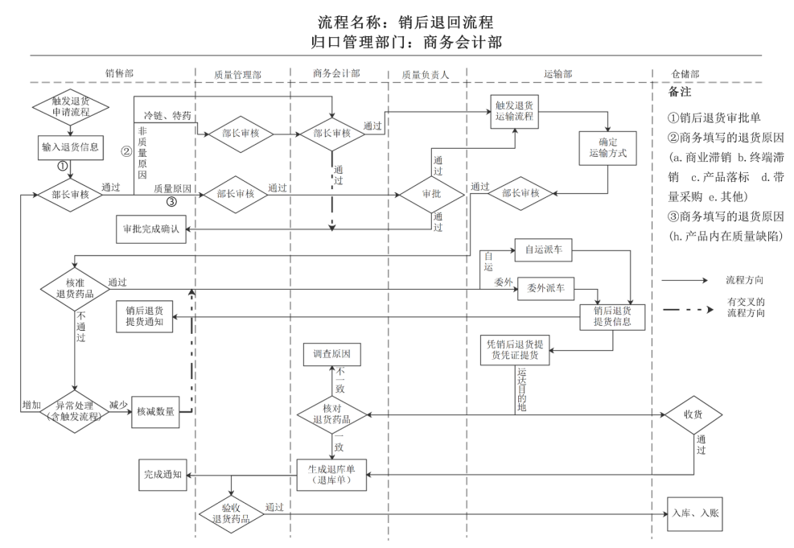

# 接口开发方式

## 1. 直接通过接口平台

1. 通过项目管理添加Action 生成一个接口号，可以直接再action写sql语句获取数据
2. Model 是字段 用户可以输入的字段进行查询
3. 可以通过DLL文件上传的方式进行文件上传，要对dll文件进行刷新

## 退货流程接口设计

### 任务背景

> 医药公司流程优化，退货流程优化，运输过程优化
>
> 由运输部触发的任务流程是新的流程环节，具体流程图如下



工具：《***\*销后退回流程\****》文字法

| ***\*步骤\**** | ***\*流程\****           | ***\*说明\****                                               | ***\*负责人\****                                             | ***\*操作内容\****                                           | ***\*工具\**** |
| -------------- | ------------------------ | ------------------------------------------------------------ | ------------------------------------------------------------ | ------------------------------------------------------------ | -------------- |
| 1              | 触发退货申请流程         |                                                              | 销售部                                                       | 销售部相关人员根据退货单位的退货要求，及时在手机或者电脑的移动版OA中触发退货申请流程。 |                |
| 2              | 输入退货信息             |                                                              | 销售部相关人员                                               | 进入退货申请流程后，销售部相关人员根据要求输入退货药品的信息。包括：品规、退货原因、订单号、退货数量及系统初步确定的运输方式（自运或委外）等。信息填写完成后，保存并提交。流程传给销售部部长。并通过系统发送信息提醒销售部相应内勤及时打印销后退货审批单，并在相应位置签字。 退货采用自运方式的执行标准如下：（1）退货药品效期要求：有效期小于或等于18个月的药品：效期为10个月以上（含10个月）；有效期大于18个月的药品：效期为1年以上(含1年）。（2）退货药品货值要求：单笔退货货值10000元及以上的药品；（3）药品包装：整件药品。 ***\*注：召回及追回药品需自运\**** | 退货审批单     |
| 3              | 部长审核                 |                                                              | 销售部                                                       | 销售区域经理根据计算机系统流程中的退货审批单和经销售内勤签字的纸质销后退货审批单，确认无误后，在流程中审核通过并在纸质的销后退货审批单签字。 |                |
| 4              | 部长审核                 | 属商业滞销、终端滞销、产品落标、带量采购及其他类型的退货审核及审批 | 质量管理部                                                   | 退货药品为冷链及特殊管理药品的，系统将流程传给质量管理部部长，质量管理部部长根据相应的政策法规及公司管理要求等进行审核，确认无误后完成流程审核，并在纸质审批单中签字。如通过，系统将销后退回流程通过***\*网页版\****传给商务会计部部长。不通过，填写原因退给销售区域经理。 |                |
| 5              | 部长审核                 | 商务会计部                                                   | 纸质的销后退货审批单由销售内勤送给商务会计部部长。商务会计部部长根据公司政策或者向分管领导请示，审核退货原因的正确性及如何承担相应费用。确定是否审批通过。根据纸质销后退货审批单位的审批结果，审核销售部相关人员触发的退货申请流程。如果审核通过，纸质审批单由相关人员转商务会计部退货会计，用于核准退货药品实物。计算机系统将退货申请流程中的相应信息传给运输部调度员，由调度员触发退货运输流程。如果审核不通过，退给销售区域经理。 |                                                              |                |
| 4              | 部长审核                 | 属产品内在质量缺陷的退货审核及审批                           | 质量管理部                                                   | 退货原因为产品内在质量缺陷的，销售部区域经理审核完成后，系统将流程传给质量管理部部长，质量管理部部长核实是否属于产品内在质量缺陷，如属于产品内在质量缺陷的，审核通过，流程传给质量负责人。如核实非产品内在质量缺陷的，退回销售区域经理。 |                |
| 6              | 审批                     | 质量负责人                                                   | 质量负责人根据系统传过来的流程，确定是否通过。如果通过，计算机系统将退货申请流程中的相应信息传给运输部调度员，由调度员触发退货运输流程;如果不通过，退给质量管理部部长。 |                                                              |                |
| 7              | 审批完成确认             |                                                              | 销售部                                                       | 根据商务会计部部长或者质量负责人的审批通过结果，由系统将流程传给触发流程的销售部相关人员确认完成，方便触发流程的销售部相关人员做好退货的准备工作。 |                |
| 8              | 触发退货运输流程         |                                                              | 运输部                                                       | 运输部调度员根据计算机系统初步确定的运输方式和系统传递过来的退货申请流程信息，触发退货运输流程。 |                |
| 9              | 确定运输方式             |                                                              | 运输部                                                       | 运输部调度员根据药品货值及运输成本等确定最终运输方式（自运或委外）及大约的提货时间，确认自运不便或价值超出运输成本的，可以改为委托运输（特殊情况的，需联合质量管理部确定承运单位），流程传至运输部部长审批。 |                |
| 10             | 部长审核                 |                                                              | 运输部                                                       | 运输部部长根据调度员确定的运输方式，根据车辆运营情况，确认自运或者委外。如通过，流程传给销售部触发退货流程的相关人员确认。如不通过，退给调度员。 |                |
| 11             | 核准退货药品             |                                                              | 销售部                                                       | 运输部长审批完成，流程自动传送至触发退货申请的相关销售部人员（流程信息包括退货药品信息、运输方式、预计提货时间等），销售部相应人员合理安排时间到退货单位办理退货手续，当面清点药品，确认是否与退货申请数量及对方退货单据一致，如一致，则在对方退货单中签字，并将退货封箱（贴本公司封箱标识，注明退货药品明细），对方退货单据需一并随货封入。及时在OA流程中完成确认操作，流程自动传至运输部调度OA。 |                |
| 12             | 异常处理（含触发流程）   |                                                              | 销售部                                                       | 如实际退货数量与退货审批数量不一致，销售人员需要重新触发退货申请审批流程，申请数量填写差额数量（如减少则填写负数，如增加则填写正数），并注明变更原因，申请数量为负数的，系统自动完成退货申请审批流程，流程传给运输部调度员。申请数量为正数的，重新按相应审批流程完成审批。 |                |
| 13             | 自运派车                 |                                                              | 运输部                                                       | 运输部调度员接收到相应流程后，如果审核通过的运输方式是自运的，按自运的流程进行派车。运输记录从这个节点开始记录，退货药品运回后，自动生成相应运输记录。 |                |
|                | 委外派车                 |                                                              | 运输部                                                       | 运输部调度员接收到相应流程后，如果审核通过的运输方式是委外的，按委外的流程进行派车。运输记录从这个节点开始记录，退货药品运回后，自动生成相应运输记录。 |                |
| 14             | 销后退货提货信息         |                                                              | 销售部                                                       | 根据运输部调度员确认的运输方式、驾驶员信息、大约到达退货单位的时间、退货药品的数量等信息生成销后退货提货通知，发送给触发流程的销售部相关人员，方便做好退货的交接工作。 |                |
| 15             | 销后退货提货通知         |                                                              | 销售部                                                       | 根据运输部调度员确认的运输方式、退货药品的数量等信息生成销后退货提货通知（提货人员联系方式、车牌号、退货药品的相应信息），发送给触发流程的销售部相关人员，方便做好退货的交接工作。 |                |
| 16             | 凭销售退货提货空凭证提货 |                                                              | 运输部                                                       | 需要委外运输的，由运输部调度员将相应的信息通过可靠的方式给委托单位的联系人。无论是委外还是自运，均需凭销后退货提货单到退货单位与销售部相关人员及退货单位相应人员一起交接退货药品。 |                |
| 17             | 收货                     |                                                              | 仓储部                                                       | 仓储部负责退货药品收货的岗位人员根据退货单位的退库单据、退货实物、计算机系统最终退货数量等信息进行收货。核对无误后，在流程内填写退货药品的到货数量等信息，完成退货药品收货操作，计算机系统生成销后退回药品收货记录。 |                |
| 18             | 核对退货药品、生成退库单 |                                                              | 商务会计部                                                   | 商务会计部退货会计根据退货药品实物、退货单位的退货单、计算机系统退货申请数据进行核对。核对无误后，在流程内填写退货药品的数量及退入的库房等信息，生成药品退库单，此时药品库存质量状态为待验，计算机系统生成药品销后退回记录。流程传至质量管理部验收员OA。如药品实物与退货审批单据及退货单位单据不符，需启动原因调查。 |                |
| 19             | 调查原因                 |                                                              | 商务会计部                                                   | 如药品实物与退货审批单据及退货单位单据不符，由商务会计部退货人员报告质量管理部、销售部和运输部，由相关部门联合启动退货药品异常情况调查，确定具体责任人，并确定处理措施。 |                |
| 20             | 完成通知                 |                                                              | 销售部                                                       | 商务会计部完成退库单流程生成退库单后，系统通知触发流程的销售部相关人员。 |                |
| 21             | 退货验收                 |                                                              | 质量管理部                                                   | 质量管理部验收人员收到退货药品验收流程后，按验收标准抽样验收，完成退货药品验收流程，计算机系统自动生成相应的销后退回药品验收记录。 |                |
| 22             | 入库、入账               |                                                              | 仓储部及相应部 门                                            | 仓储部相应岗位根据验收结果将相应的退货药品入库，合格药品入合格库，不合格药品入不合格库，及时完成退货单审核，生成“库存记录”。商务会计部相关人员打印退货单交销售部内勤，销售内勤将退货单、退货单位的退货单据和红字发票信息表送至财务部审核后转交业务部开票岗位开具红字发票。由开票岗位将上述材料交财务入账。 |                |

##  第8项 触发退货流程设计

### 目的

> 根据退货单进行触发派车流程

### 条件

> 退货审批单状态为终审，且不存在运输记录

### SQL语句设计

**相关表**：

退货审批单

​	主表：DH(单号唯一) DW往来单位编码对应城市ID ZT为2表示审核通过的 

​	 从表：DH(多个) THYY退货原因 YSFS运输方式

城市信息表：ID和和主表的DW关联 DW前四位省级单位或直辖市 前六位是市级 全部是医院信息

运输记录表： [YSJL_P] KCDJH(库存单据号)和 退货审批单单号对应

```sql
--获取省级数据
/*SELECT LEFT(DW,4) ID,
(select Name from Client where ID= LEFT(DW,4)) cityName,SUM(BZJS) BZJS 
FROM X_THSP_P XTP,Client CLT
WHERE XTP.ZT =2 
and DH not in (select KCDJH FROM YSJL_P) 
and CLT.ID=left(XTP.DW,4) 
group by LEFT(DW,4)*/

--市级数据
/*SELECT LEFT(DW,6) ID,
(select Name from Client where ID= LEFT(DW,6)) cityName,SUM(BZJS) BZJS 
FROM X_THSP_P XTP,Client CLT
WHERE XTP.ZT =2 
and DH not in (select KCDJH FROM YSJL_P) 
and CLT.ID=left(XTP.DW,6) 
group by LEFT(DW,6)*/

--获取详细信息
/*select DISTINCT XTP.DH,
(select Name from Client where ID= LEFT(XTP.DW,4)) city_p,
(select Name from Client where ID= LEFT(XTP.DW,6)) city_s,
(select Name from Client where ID=XTP.DW) hospitalName,
XTP.BZJS,
XTS.YSFS,
XTS.THYY 
from X_THSP_P XTP,X_THSP_S XTS  
where XTP.DH=XTS.DH  
and XTP.ZT =2 
and XTP.DH not in (select KCDJH FROM YSJL_P)*/
```

```json
{
    "ID": "2201",
    "cityName": "北京市",
    "BZJS": 3,
    "child": [
        {
            "ID": "220102",
            "cityName": "朝阳区",
            "BZJS": 3,
            "child": [
                {
                    "dh": 620100052,
                    "city_p": "北京市",
                    "city_s": "朝阳区",
                    "hospitalName": "红惠医药有限公司",
                    "bzjs": 1,
                    "ysfs": ""
                }
            ]
        }
    ]
}
```


**退货审批单库表**

主表：X_THSP_P 

| 字段名 | 说明         | 类型           | 必须 | 备注                                                         |
| ------ | ------------ | -------------- | ---- | ------------------------------------------------------------ |
| DH     | 单号         | Int            | Y    | 关键字：自动编号（删除后，不重用），编号规则：serverID（1位）+四位年月+当月顺序号。 |
| SN     | 编码         | VARCHAR（10）  | Y    | 纸质审批单印制号                                             |
| RQ     | 日期         | smalldatetime  | Y    | 申请退货日期                                                 |
| DW     | 往来单位编码 | VARCHAR（10）  | Y    | 往来单位编码—对应Client表的ID                                |
| THLX   | 退货类型     | Bit            | Y    | 0-正常，1-私自                                               |
| ZT     | 状态         | tinyint        | Y    | 0-待审，1-审核，2-初审，20-批准，21-复核，3-收货，4-完结，5-终止 |
| BZ     | 备注         | VARCHAR（500） | N    |                                                              |
| TZ     | 填制         | VARCHAR（16）  | Y    |                                                              |
| SHRQ   | 收货日期     | smalldatetime  | N    | 退货仓库收到退货的日期                                       |

从表：X_THSP_S 

| 字段名 | 说明         | 类型           | 必须 | 备注                                                         |
| ------ | ------------ | -------------- | ---- | ------------------------------------------------------------ |
| DH     | 单号         | Int            | Y    | 关键字：自动编号（删除后，不重用），编号规则：serverID（1位）+四位年月+当月顺序号。 |
| XH     | 序号         | smallint       | Y    | 关键字：序号，基于1开始，序号可以不连续                      |
| CP     | 退货产品编码 | VARCHAR（10）  | Y    | 产品编码—对应Materiall表的ID                                 |
| PH     | 退货产品批号 | VARCHAR（30）  | N    | 给退货公司发过的产品批号                                     |
| JLDW   | 计量单位     | VARCHAR（10）  | N    | 其值必须为对应Matrial表的StoreUnit （存储单位）或Unit（购销单位） |
| ZHXS   | 转换系数     | smallint       | N    | JLDW=StoreUnit时其值为1，JLDW=Unit时为Material.UnitFactor    |
| SQSL   | 申请退货数量 | Money          | Y    |                                                              |
| THYY   | 退货原因     | VARCHAR（500） | Y    | 有定义的标准值。质量原因退货的以“质量-”开头，非质量原因退货的以“非质量-”。比如：质量-药品召回，非质量-终端滞销等。 |
| DDH    | 订单号       | Int            | N    |                                                              |
| DDHH   | 订单行号     | smallint       | N    |                                                              |
| SSSL   | 实收退货数量 | Money          | N    | 默认为空，收货时填写实际收到数量；无实物退货时，其值为0.     |
| CYYY   | 差异原因     | VARCHAR（50）  | N    | 实收退货数量与申请退货数量不一致时，填写差异原因（无实物退货时，实收数量为0，差异原因也为空）。现在要求实收和申请必须一致，这个原因就都为空。 |
| CYCLSJ | 差异处理时间 | smalldatetime  | N    | 库存报废时按时间暗抵计算对应的实物数                         |
| YSFS   | 运输方式     | VARCHAR（10）  | N    | 标准值：自运、委外                                           |

 

主表：X_THSP_S_ZRFP 承担责任信息

| 字段名 | 说明                 | 类型          | 必须 | 备注                                                         |
| ------ | -------------------- | ------------- | ---- | ------------------------------------------------------------ |
| DH     | 单号                 | Int           | Y    | 关键字：自动编号（删除后，不重用），编号规则：serverID（1位）+四位年月+当月顺序号。 |
| XH     | 序号                 | VARCHAR（10） | Y    | 关键字：序号，基于1开始，序号可以不连续                      |
| YWY    | 承担责任业务员区域码 | VARCHAR（12） | Y    | 关键字：业务区域编码—对应X_YWQY表的ID                        |
| ZRBL   | 状态                 | Smallmoney    | Y    | 承担比例                                                     |
| ZW     | 职务                 | VARCHAR（10） | N    |                                                              |
| FYL    |                      | Smallmoney    | N    | 扣率                                                         |
| JE     | 承担金额             | Money         | N    | 退货仓库收到退货的日期                                       |

 

附表：X_THSP_ZRR 状态改变记录 

| 字段名 | 说明   | 类型          | 必须 | 备注                                                         |
| ------ | ------ | ------------- | ---- | ------------------------------------------------------------ |
| DH     | 单号   | Int           | Y    | 关键字：自动编号（删除后，不重用），编号规则：serverID（1位）+四位年月+当月顺序号。 |
| ZT     | 状态   | tinyint       | Y    | 0-待审，1-审核，2-初审，20-批准，21-复核，3-收货，4-完结，5-终止 |
| RQ     | 日期   | smalldatetime | Y    | 改为当前状态的时间                                           |
| ZRR    | 责任人 | VARCHAR（10） | Y    | 改为当前状态的操作员                                         |

 

 


